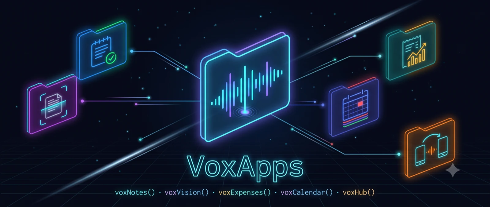
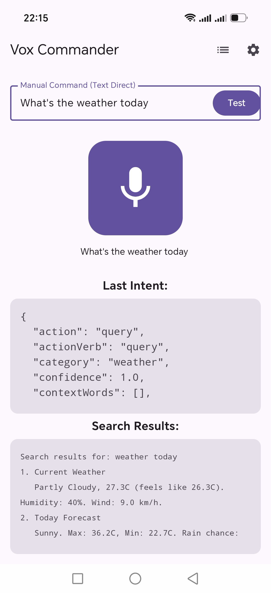
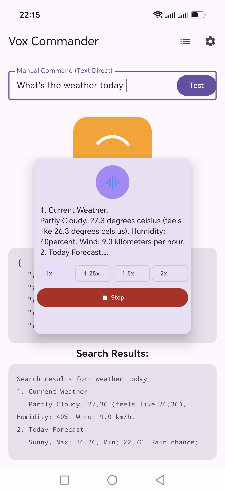

<a name="readme-top"></a>

<p align="center">
  
</p>

# VoxCommander

<p align="center">
  <strong>On-device voice assistant for Android — local wake word, STT, and intent routing, with optional cloud AI.</strong>
</p>

<p align="center">
  <a href="LICENSE">
    
  </a>
</p>

## Build Status

Build status, latest published tag, when that APK was actually built, real APK size, and a direct
download link — one row per app, fully generated from this repo's actual GitHub Releases (see below
the table for how).

<!-- LATEST_RELEASES:START -->
<!-- Auto-generated by scripts/update_release_readme_links.sh — do not hand-edit. Regenerated on
     every GitHub release (see .github/workflows/update-readme-releases.yml). Last updated 2026-08-15. -->

| App | Build | Latest tag | Built (UTC) | APK size | Install |
|-----|-------|-----------|-------------|----------|---------|
| **Vox Commander** | [](https://github.com/razvan-eduard/VoxApps/actions/workflows/release-commander.yml) | [`commander-v0.30-beta (pre-release)`](https://github.com/razvan-eduard/VoxApps/releases/tag/commander-v0.30-beta) | 2026-08-13 08:38 UTC | 44.2 MB | [Download APK](https://github.com/razvan-eduard/VoxApps/releases/download/commander-v0.30-beta/VoxCommander-commander-v0.30-beta.apk) |
| **Vox Calendar** | [](https://github.com/razvan-eduard/VoxApps/actions/workflows/release-calendar.yml) | [`calendar-v0.20`](https://github.com/razvan-eduard/VoxApps/releases/tag/calendar-v0.20) | 2026-08-09 20:19 UTC | 10.6 MB | [Download APK](https://github.com/razvan-eduard/VoxApps/releases/download/calendar-v0.20/VoxCalendar-calendar-v0.20.apk) |
| **Vox Expenses** | [](https://github.com/razvan-eduard/VoxApps/actions/workflows/release-expenses.yml) | [`expenses-v0.31`](https://github.com/razvan-eduard/VoxApps/releases/tag/expenses-v0.31) | 2026-08-09 20:19 UTC | 10.2 MB | [Download APK](https://github.com/razvan-eduard/VoxApps/releases/download/expenses-v0.31/VoxExpenses-expenses-v0.31.apk) |
| **Vox Notes** | [](https://github.com/razvan-eduard/VoxApps/actions/workflows/release-notes.yml) | [`notes-v0.20`](https://github.com/razvan-eduard/VoxApps/releases/tag/notes-v0.20) | 2026-08-09 20:18 UTC | 9.7 MB | [Download APK](https://github.com/razvan-eduard/VoxApps/releases/download/notes-v0.20/VoxNotes-notes-v0.20.apk) |
| **Vox Vision** | [](https://github.com/razvan-eduard/VoxApps/actions/workflows/release-vision.yml) | [`vision-v0.15`](https://github.com/razvan-eduard/VoxApps/releases/tag/vision-v0.15) | 2026-08-11 15:43 UTC | 62.2 MB | [Download APK](https://github.com/razvan-eduard/VoxApps/releases/download/vision-v0.15/VoxVision-vision-v0.15.apk) |
| **Vox Hub** | [](https://github.com/razvan-eduard/VoxApps/actions/workflows/release-hub.yml) | [`hub-v0.12`](https://github.com/razvan-eduard/VoxApps/releases/tag/hub-v0.12) | 2026-08-09 19:29 UTC | 6.5 MB | [Download APK](https://github.com/razvan-eduard/VoxApps/releases/download/hub-v0.12/VoxHub-hub-v0.12.apk) |

<!-- LATEST_RELEASES:END -->

<!-- This table is never hand-edited — every release-<app>.yml workflow publishes a GitHub Release,
     which triggers update-readme-releases.yml to regenerate the block above from whatever's
     actually published, APK size included (fetched from the release asset itself, not a
     hand-maintained snapshot — see scripts/update_release_readme_links.sh). A manual
     workflow_dispatch run of any release workflow rebuilds under the current version without a
     version bump, and publishes only if you tick its `publish` input — see
     docs/BUILD_AND_RELEASE.md. -->


Official F-DROID Repo : https://razvan-eduard.github.io/vox-fdroid-repo/repo/


Alternative Install via `adb install <file>.apk` or by opening the downloaded file and allowing "Install unknown
apps."

> **Note**: If you're installing more than one Vox app, stick to official releases for all of them (or
> build all of them yourself) rather than mixing an official release of one with a self-built copy of
> another — installing side by side otherwise can fail (all apps share one release signing
> certificate; see [Satellite App Guide §8.1](docs/SATELLITE_APP_GUIDE.md#81-signature-level-permissions-are-the-entire-trust-mechanism)
> for why that's load-bearing, not just a convention).

---

> **VoxApps monorepo.** This repository hosts several **fully independent** Android apps that can
> optionally talk to each other: **Vox Commander** (the voice assistant this README covers), **Vox
> Notes**, **Vox Vision**, **Vox Expenses**, **Vox Calendar**, and **Vox Hub**. Install any subset —
> see [📦 App Overview](#app-overview) below for what each one does, or
> [`docs/APPS_OVERVIEW.md`](docs/APPS_OVERVIEW.md) for the full feature list per app.

| App | What it does |
|-----|--------------|
| 🎙️ [**Vox Commander**](#-vox-commander) | On-device voice assistant — wake word, Whisper STT, a 3-layer AI pipeline, and instant FastMap voice-shortcut rules you define yourself. |
| 📝 [**Vox Notes**](#-vox-notes) | Encrypted on-device notes, created by voice or by hand, with AI-assisted category/duplicate cleanup. |
| 📷 [**Vox Vision**](#-vox-vision) | Privacy-first document scanner — on-device OCR, no cloud round-trip, forwards clean text to Notes/Expenses. |
| 💸 [**Vox Expenses**](#-vox-expenses) | Encrypted on-device expense tracker — voice, receipt scan, or automatic bank-notification capture. |
| 📅 [**Vox Calendar**](#-vox-calendar) | Encrypted on-device calendar with natural-language scheduling and a built-in ToDo Lists system. |
| 🗂️ [**Vox Hub**](#-vox-hub) | Backup, restore, and cloud-free peer-to-peer sync across the whole family of apps. |

## 📖 Table of Contents

- [🚦 Build Status](#build-status)
- [📋 Requirements](#requirements)
- [⚡ Quick Start](#quick-start)
  - [Run Tests](#run-tests)
- [📦 App Overview](#app-overview)
  - [Vox Commander](#-vox-commander)
  - [Vox Notes](#-vox-notes)
  - [Vox Vision](#-vox-vision)
  - [Vox Expenses](#-vox-expenses)
  - [Vox Calendar](#-vox-calendar)
  - [Vox Hub](#-vox-hub)
- [🧰 Key Technologies](#key-technologies)
- [📚 Further Reading](#further-reading)
- [⚠️ License](#license)
- [🤝 Contributing](#contributing)

[↖ Back to top](#readme-top)

## Requirements

Same baseline for every app in this repo:

- **Android 10+** (API 29)
- **arm64-v8a** architecture
- See the [Build Status](#build-status) table above for each app's actual APK size — anything
  beyond the base install (e.g. Commander's Whisper and GGUF LLM models, Vosk/onnxruntime)
  downloads on demand
- Optional, app-specific extras (e.g. Commander's OpenAI API key for cloud NLU, Spotify Client ID
  for media control) are called out in that app's own [App Overview](#app-overview) entry

[↖ Back to top](#readme-top)

## Quick Start

Every app is its own Gradle module — swap `<app>` below for `vox-commander`, `vox-notes`,
`vox-vision`, `vox-expenses`, `vox-calendar`, or `vox-hub`; each has the same set of tasks.

```bash
# Clone
git clone https://github.com/razvan-eduard/VoxApps.git
cd VoxApps

# Build (debug)
./gradlew :<app>:assembleDebug

# Install on connected device
./gradlew :<app>:installDebug
```

**Submodules.** Commander compiles whisper.cpp and llama.cpp from source and Vision needs OpenCV
built locally, so those two need their vendored upstreams before they will build:

```bash
git submodule update --init --depth 1 vox-commander/src/main/cpp/whisper.cpp   # Commander
git submodule update --init --depth 1 vox-commander/src/main/cpp/llama.cpp     # Commander
git submodule update --init --depth 1 vendor/opencv                            # Vision
```

(`vendor/openwakeword-android-kt` is not needed to build: the fork Commander actually compiles lives
in `core/wakeword`; the submodule holds pristine upstream for the sync scripts only.)

The first Commander and Vision builds are slow because of those native compiles; later builds reuse
the output. `-PvoxSkipNativePrep` skips Commander's whisper.cpp and llama.cpp compiles when you only
want to know whether the Kotlin compiles; the upstream-version checks are on-demand tasks, attached
to no build. Notes, Expenses, Calendar and Hub need no submodules at all.

### Run Tests

```bash
# Unit tests (JVM — no device needed)
./gradlew :<app>:testDebugUnitTest

# Instrumented tests (requires connected device/emulator)
./gradlew :<app>:connectedAndroidTest
```

Every push to `main` and every pull request runs the whole suite plus a debug build of all six apps
(`.github/workflows/ci.yml`). See [Build & Release](docs/BUILD_AND_RELEASE.md) for what else runs and
when.

[↖ Back to top](#readme-top)

## App Overview

Each app below is fully independent — install any subset. Vox Commander can optionally talk to the
others by voice once they're installed (e.g. "add a note", "add an expense"). Every section here is a
short summary; see [`docs/APPS_OVERVIEW.md`](docs/APPS_OVERVIEW.md) for the full feature list of each
app, with implementation-level detail.

### 🎙️ Vox Commander

On-device voice assistant. Wake word (Vosk/Porcupine/OpenWakeWord) and on-device Whisper STT feed a
3-layer AI pipeline — instant FastMap voice-shortcut rules you define yourself, a primary AI (OpenAI
cloud, or an on-device model through llama.cpp or LiteRT-LM), then an automatic offline fallback; app control,
media/search/navigation/messaging, and system toggles (volume, WiFi, flashlight, DND, and more) all
route through the same pipeline. A shared location system (cached last-known location, a Home Town
fallback, "always use this location") and its own Backup & Restore screen round it out.




Demo: asking for the weather, navigating with Waze, and playing music — all by voice.

https://github.com/user-attachments/assets/ff61a5de-d59c-4bdf-aacc-55bb1034cc07

→ [Full feature list](docs/APPS_OVERVIEW.md#vox-commander)

### 📝 Vox Notes

Encrypted on-device notes app. Create notes by voice through Commander or by hand; AI-assisted category
cleanup and duplicate-note review (nothing auto-deleted without confirmation); a shared category color
picker (scrollable presets + a full custom-color screen) with inline "+ New category…" creation right
from the note editor; an optional split grid-and-list calendar view instead of the plain list; photo
attachments via camera or gallery with a paperclip indicator; a home-screen widget; syncs with another
phone via Vox Hub, plus its own Backup & Restore screen.


→ [Full feature list](docs/APPS_OVERVIEW.md#vox-notes)

### 📷 Vox Vision

Document scanner. Camera capture with auto-detected document bounds and auto-capture, on-device OCR (no
network round-trip), edge-cropping, then forwards the cleaned text to Vox Notes or Vox Expenses as a new
record. A table mode reconstructs tabular documents (invoices) row by row when the requesting app declares
the scan tabular, so the extracted text follows the printed rows.

→ [Full feature list](docs/APPS_OVERVIEW.md#vox-vision)

### 💸 Vox Expenses

Encrypted on-device expense tracker. Three ways in — voice, receipt-scan OCR (invoice totals read
deterministically from the printed text), or automatic capture from bank/payment notifications
(deterministically pre-parsed, matched against learned notification templates, durably queued and
retried) — plus manual entry; rescanning a receipt shows each corrected field as its own suggestion
instead of silently overwriting anything; transaction direction (Total vs. Received in Reports), a
user-configurable duplicate-rule engine (email-filter-style: any field, AND/OR, multiple rules,
Off/Local/Local+AI/AI protection modes), spelling-correction memory and WHEN/THEN re-map rules learned
from your edits — managed together with duplicates and notification templates from one "Expense cleanup
and rules" settings menu — a shared location system with Commander, per-category spending limits with
alerts, multi-currency reports, photo attachments via camera or gallery with a paperclip indicator, an
optional calendar view, a home-screen widget, sync with another phone via Vox Hub, and its own Backup &
Restore screen.


Receipt scanning enriches the existing expense:

https://github.com/user-attachments/assets/d348e5ca-4c92-4b45-b615-1f9e62f9bfee


→ [Full feature list](docs/APPS_OVERVIEW.md#vox-expenses)

### 📅 Vox Calendar

Encrypted on-device calendar. Colored, named layers instead of a rigid category tree; natural-language
event/task creation through Commander ("dentist in a week"); a ToDo Lists system with an inline
node editor, routine lists that reset at midnight, per-weekday recurrence, star markers, a "now"/"Up
next" timeline, due-date bleed onto the calendar/widget, and dedicated to-do home-screen widgets (all
lists, or one pinned list); ICS import/export for interop
with Google Calendar/Thunderbird/Apple Calendar; a day view that opens at the current time, also shows
that day's Notes and Expenses, and tells you when there's "Nothing else today"; photo attachments with
a paperclip indicator; syncs with another phone via Vox Hub, plus its own Backup & Restore screen.


→ [Full feature list](docs/APPS_OVERVIEW.md#vox-calendar)

### 🗂️ Vox Hub

Backup, restore, and peer-to-peer sync. Zero-config export/import (discovers every installed Vox app
automatically), scheduled backups with retention and a failure banner, a global Import mode (Full
override / Merge / Additive) applied across every app, with the chosen mode's caveat stated right at
the restore point, NFC-paired, Bluetooth-transferred bidirectional
sync between two phones for Notes/Calendar/Expenses, and VoxConnect — your phone scans a QR code shown
on the desktop companion app to pair, since most desktops have no camera — no cloud involved. Every
companion app also has its own local Backup & Restore screen, interchangeable with Hub's own files.

→ [Full feature list](docs/APPS_OVERVIEW.md#vox-hub)

[↖ Back to top](#readme-top)

## Key Technologies

| Component | Technology |
|-----------|-----------|
| UI | Jetpack Compose, Material 3 |
| STT | Whisper.cpp (GGML, on-device) |
| Wake Word | Vosk, Picovoice Porcupine, OpenWakeWord |
| NLU | OpenAI API, On-device LLM (llama.cpp GGUF, or LiteRT-LM .task/.litertlm behind the Google consent toggle) |
| TTS | Android TextToSpeech, Piper TTS |
| Storage | DataStore, EncryptedSharedPreferences, Room (+ SQLCipher on the satellite apps) |
| Media | Spotify, YouTube (NewPipe Extractor / Piped), MediaSession API |
| Navigation | Waze, Google Maps |
| Search | DuckDuckGo, Wikipedia, Google News, GNews, Currents API, NewsAPI, WeatherAPI, Open-Meteo |

[↖ Back to top](#readme-top)

## Further Reading

- [`docs/APPS_OVERVIEW.md`](docs/APPS_OVERVIEW.md) — the full feature list for Vox Notes, Vision,
  Expenses, Calendar, and Hub.
- [`docs/TECHNICAL_DOCUMENTATION.md`](docs/TECHNICAL_DOCUMENTATION.md) — deep-dive on `vox-commander`'s
  architecture, wake word/STT/NLU/TTS engines, intent routing, the cross-app Vox contract (including the
  durable pending-request queue LLM broadcasts now go through), and the monorepo's project structure.
- [`docs/SATELLITE_APP_GUIDE.md`](docs/SATELLITE_APP_GUIDE.md) — hands-on developer guide for building
  a new satellite app: Gradle/manifest setup, the full `:core:ipc` contract reference, the generic LLM
  hook (and its durable-delivery queue), collapsed extraction (`@VoxExtractionSchema`/KSP), the security
  model, and a debugging checklist.
- [`docs/BUILD_TIME_DEPENDENCIES.md`](docs/BUILD_TIME_DEPENDENCIES.md) — monorepo-wide reference for
  every native/ML dependency that's a binary version-check or vendored/patched/compiled from source at
  build time (Vosk, NewPipe Extractor, Whisper.cpp, llama.cpp, OpenWakeWord, OpenCV, PaddleOCR
  ppocr-sdk).

[↖ Back to top](#readme-top)

## License

GNU GPLv3 — see [`LICENSE`](LICENSE). This covers the code in this repository; third-party
dependencies keep their own licenses (see [`docs/BUILD_TIME_DEPENDENCIES.md`](docs/BUILD_TIME_DEPENDENCIES.md)
for the vendored/patched ones). `vox-commander` additionally bundles two proprietary components not
covered by the GPLv3 license above: the Spotify App Remote SDK
(`vox-commander/libs/spotify-app-remote.aar`) and Picovoice Porcupine
(`ai.picovoice:porcupine-android`) — both closed-source, each under its own vendor license.

[↖ Back to top](#readme-top)

## Contributing

This is a personal project. If you'd like to contribute, please open an issue first to discuss your changes.

[↖ Back to top](#readme-top)
