# Vox Apps — Feature Reference

Detailed feature-level documentation for every app in the VoxApps monorepo — Vox Commander and its five
companion apps — moved out of the top-level [`README.md`](../README.md) to keep that file a short,
non-technical overview. For the architecture behind how these apps talk to Commander and each other (the
cross-app contract, `:core:ipc`, discovery, routing, day-linking, etc.), see
[`TECHNICAL_DOCUMENTATION.md`'s §19 Vox Apps Ecosystem](TECHNICAL_DOCUMENTATION.md#19-vox-apps-ecosystem-cross-app-contract).
For building a new satellite app from scratch, see [`SATELLITE_APP_GUIDE.md`](SATELLITE_APP_GUIDE.md).

## Vox Commander

Standalone, on-device voice assistant (`com.voxapps.commander`) — the "core" app the rest of the
ecosystem plugs into, though it works completely on its own with no companion apps installed.

- **Wake word** — always-on listening via Vosk, Picovoice Porcupine, or the fully open-source
  OpenWakeWord (ONNX-based); an **External Trigger** toggle also lets automation apps (MacroDroid,
  Tasker) start a listen without the wake word at all, via the broadcast action
  `com.voxapps.commander.TRIGGER_VOICE` (Settings → App Manager).
- **On-device Whisper STT** (Whisper.cpp/GGML) with multilingual model downloads, and **Piper TTS**
  (on-device neural voices) alongside standard Android TextToSpeech — both configurable in Settings →
  Service, which also has speech rate/pitch sliders and an audio-focus choice for what happens to other
  media while Commander talks (ignore it, lower its volume, or pause it).
- **Command pipeline** — every spoken command is processed in this order:
  1. **FastMap rules** (see below) — instant, free, entirely offline pattern matches you define
     yourself. Plain keyword/regex matching, not AI. If one fires, nothing else runs.
  2. **AI Intent Translator** (Settings → AI & Models → Intent Engines) — the actual AI step, reached
     only when no FastMap rule fires: your choice of a cloud LLM (OpenAI) or one of two on-device
     runtimes. **llama.cpp** reads GGUF models with grammar-constrained decoding, so the model can
     only emit a valid intent. **LiteRT-LM** reads `.task`/`.litertlm` models with the equivalent
     constrained decoding, and is Google-built software running entirely on the phone — so it stays
     out of reach until *Google on-device support* (Settings → Advanced) is switched on, and it is
     never the default. Which runtime serves an engine is declared in the schema, so a model file
     always reaches the runtime that can read it. Both runtimes ship inside the APK; the models
     themselves (Qwen 2.5 0.5B–3B, Qwen 3 0.6B, Gemma 3 1B, in several quantizations and formats)
     download on demand from the signed schema catalog, and a download whose bytes don't match the
     schema's declared sha256 is refused.
  3. **Offline fallback** — a *separately*-configured backup engine+model used only if the AI step
     above fails or is unreachable (skipped automatically if it'd be identical to it).

  
  

- **FastMap Rules Manager** (Rules Manager screen) — build instant, deterministic voice shortcuts that
  skip the AI entirely. Speak or type a sample phrase, then tap individual words to mark them as
  **Trigger** words (when the rule activates) or, depending on mode, **Search term** words (the argument
  passed to whatever gets launched). "Add Alternative Trigger" lets one rule respond to several different
  phrasings at once (OR logic — any group matching fires the rule). A 3-way **Search term & trigger
  mode** selector controls how the query is produced and how strictly the trigger phrase has to match:
  - **Manual** — you pick the exact query words yourself.
  - **Auto-extract** — whatever's left over after the trigger words becomes the query automatically
    (good for "play &lt;anything&gt; on spotify"-style rules).
  - **Any word order** — the trigger words can appear in any order in what you say (e.g. "turn on the
    flashlight" and "turn the flashlight on" both match the same rule). This is mutually exclusive with
    Auto-extract by design: an any-order match is built from zero-width regex lookaheads, while
    auto-extract needs to consume the trigger text left-to-right to know what's "left over" — combining
    both would silently corrupt the extracted query, so the UI presents these as one 3-way choice rather
    than two independent checkboxes.

  

  A rule can either **launch an app** (pick a target app + one of its supported intent actions — play a
  search, open the camera, dial a number, etc.) or fire a **system command**. System commands cover 11
  actions: Volume Up/Down, WiFi/Bluetooth/GPS/Airplane-Mode/NFC (each a simple toggle — Android doesn't
  allow third-party apps to flip these silently, so the rule opens the relevant system settings panel),
  and **Flashlight/Do Not Disturb/Auto-Rotate/Silent Mode**, each with explicit **on / off / toggle**
  actions (matching the existing Volume Up/Down pattern) rather than one ambiguous action that has to
  guess direction from free text. Audio system commands (Play/Pause/Next/Prev) additionally offer a
  **Media Control Type** choice — Active Session, a pinned Default App, or physical Audio Button
  semantics.

  

  Saved rules are searchable/filterable, drag-to-reorder (first match wins, so order matters when rules
  could overlap), individually switchable active/inactive, and bulk-activatable/deactivatable. Closing
  the Rules Manager with an unsaved, in-progress rule prompts a confirmation (Cancel / Discard / **Save
  &amp; Close**) instead of silently losing your work.

  

- **App Manager** (Settings → App Manager) — two related but independent mechanisms:
  - **Default apps per category** — Audio/Maps/Messaging plus any custom category you add; check every
    candidate app, then star one as the default used when a command doesn't name a specific app (e.g.
    "play some music").
  - **App Aliases** — define a nickname that always routes to one specific installed app regardless of
    its real name (e.g. saying "youtube" launches a YouTube-frontend app like LibreTube instead). An
    alias is resolved *before* category defaults, so it always wins over whatever's starred.

  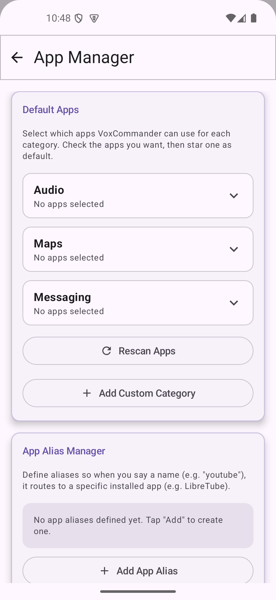

  The same tab also has a Media Session permission switch (needed to control playback in apps like
  Spotify), a "Return to previous app after action" app list, and the External Trigger toggle mentioned
  above.
- **Settings** — a menu of entries grouped under section bands (General / Engines & Models / Apps &
  Integrations / System / Data), each opening its own page: General (language, schema-repository
  options, and Theme — dark/light/system + a colored-surface option shared with the companion apps),
  AI & Models (Voice Engines + Intent Engines sub-tabs), Service (Wake Word + TTS sub-tabs), App
  Manager, Integrations (Spotify, discovered Vox Apps with per-app contract test, Piped/YouTube media,
  Search provider config), Permissions, Advanced (engine benchmark, download preference, the Engine &
  Model Management card — including two privacy gates, both **off by default**, "Cloud AI engines" and
  "Google on-device support", each restricting whatever engines the schema declares as cloud/Google-
  backed and, when switched off, clearing every engine/model selection it gated back to schema
  defaults; two experimental GPU-acceleration toggles, one per on-device engine (speech and local
  LLM), both **off by default** — enabling one runs a per-device compatibility test in a sandboxed
  process, and an incompatible device stays on the CPU; GPU execution runs on OpenCL with
  Adreno-tuned kernels, the driver is resolved at runtime (a device without one simply stays on the
  CPU), and the GPU reports its memory budget so a model too large for it stays on the CPU too; plus delete-unused-models cleanup — system
  maintenance, tutorial replay, and Logging last), and Backup & Diagnostics (one page: the backup
  card above the diagnostics list).

  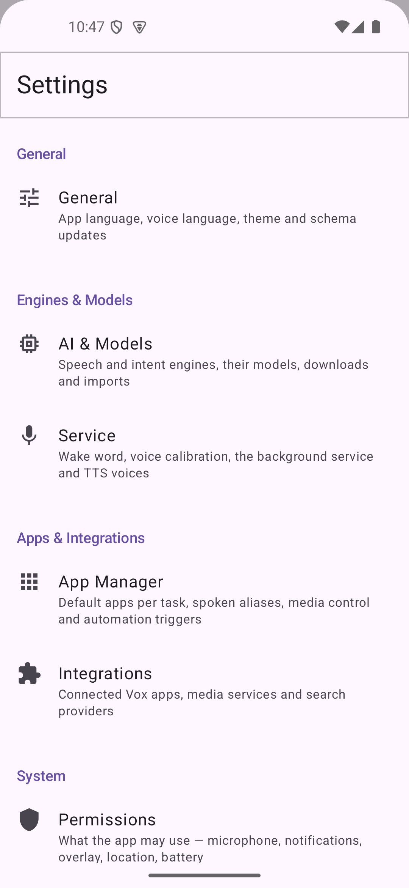
  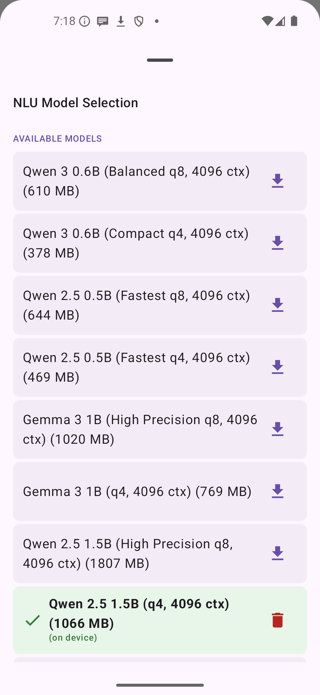
  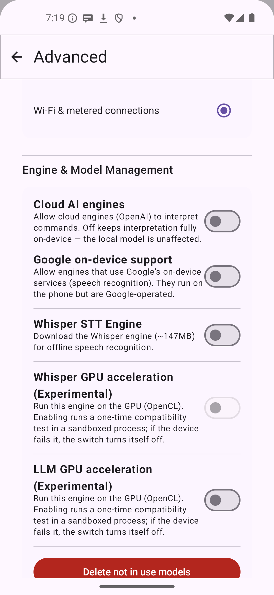

- **Media control** — search/play/pause/next/prev for Spotify, YouTube, or whatever's assigned as your
  audio default; **navigation** via Waze or Google Maps deep links; **messaging** through whichever app
  is resolved as your Messaging default or alias (WhatsApp/Telegram/SMS are common examples, not a fixed
  list — any messaging app assigned to that category works, using its own share/deep-link format where
  one exists); **search** across DuckDuckGo, Wikipedia, Google News, GNews, Currents API, NewsAPI,
  WeatherAPI, Open-Meteo, and OpenAI itself as a general/knowledge fallback.
- **Vox Apps ecosystem** — companion apps (Notes, Vision, Expenses, Calendar, Hub) are discovered
  automatically once installed and controllable by voice with no extra setup; Settings → Integrations has
  a live panel listing discovered apps with a per-app contract-verification test.
- **Location** (Settings → Integrations, shared `:core:location` module also used by Vox Expenses) — a
  cached last-known location with a configurable expiry (None/1 day/1 week/1 month/Forever), a **Home
  town** fallback used whenever GPS is unavailable and nothing's cached, and an **"Always use this
  location"** toggle that skips GPS entirely and clears any cache, for a fixed search/weather location
  regardless of where the device actually is.

  

- **Bring your own model** — any engine that reads a model file accepts files you supply — import as
  many as you like; each appears as its own row under its filename beside the downloadable ones,
  selected the same way, deleted by the same affordance, and shown with its real size. The file
  picker is filtered to the kind that engine expects, vendor archives are
  unpacked for you, and a file that isn't what the engine needs is refused *with the reason* rather
  than failing later — after which you're offered the deletion of the archive it came from. For
  engines that keep a model per language (Vosk), the language is asked at import.

  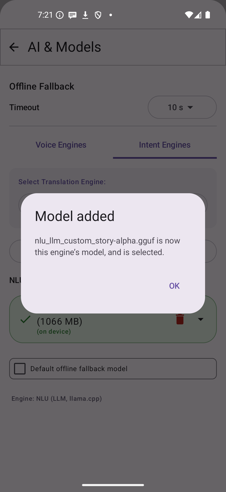

- **Schemas are served from a repository, and signed** — the JSON that defines engines, search
  providers, intents and normalisation is fetched at launch while *Check for updates* is on, so
  corrections arrive without an app update. Because those files say where requests go, a change from
  the official repository is only adopted if it carries a valid signature; the app ships a public key
  and refuses anything else. Every downloadable model URL in the schema carries its sha256; a
  downloaded artefact that doesn't match is refused. Point the app at your own fork and your schemas are still used — marked
  *unverified*, since only the maintainer can sign. The bundled copies are always one tap away.
- **Backup & Restore** (Settings → Backup & Diagnostics) — back up FastMap rules and portable settings to a
  file you pick, or restore from one, using the same zip format Vox Hub's own export/import produces;
  restoring offers a choice of **Full override**, **Merge**, or **Additive** reconciliation (see
  [Vox Hub](#vox-hub) below for the full explanation, shared by every app in the family).
- Multi-language UI (English, Romanian, German, French).

## Vox Notes

Standalone, encrypted on-device notes app (`com.voxapps.notes`, Room + SQLCipher). Voice-created
through Commander (`create`/`read`) or used entirely on its own.

- **Categories** with a coverflow-style picker; **Auto-Merge Categories** asks Commander's LLM hook to
  find and merge near-duplicate categories (e.g. "Shopping" / "Groceries")
- **Note cleanup** — the same LLM hook finds near-duplicate/redundant notes, but unlike category
  merge this only *proposes* groups (kept note + duplicates); the user reviews and taps **Apply
  selected** before anything is deleted — nothing is ever auto-deleted
- Both triggers are available **on-demand** and on a **schedule** (off/daily/weekly/monthly)
- **Scan-to-note** — receives raw OCR text from Vox Vision, sends it through the LLM hook to get a
  clean title/body and a suggested category, then creates the note
- Editor UI: tap a note's title to expand/collapse it in place (collapse via a dedicated chevron
  above the title, separated from the body by a shaded header)
- **Calendar view** (optional, off by default) — a month-paged agenda view (shared `:core:calendar`
  module) instead of the plain chronological list, with a peek into the tail/head of adjacent months
  and a "Today" button; month/weekday names follow the app's own language setting, not the device locale

  

- **Category color picker** — shared `:core:design` component (also used by Vox Expenses/Vox
  Calendar): a scrollable preset row with a clear ring around the selected swatch, plus a "Custom…"
  entry opening a full-screen color screen (Hue/Saturation/Value sliders, live preview, the same
  presets for a quick pick). Auto-generated presets sit at evenly-spaced hues so they're never visually
  close to each other. The note editor's category coverflow has a trailing "+" entry that opens this
  same picker inline, creating and immediately selecting the new category without leaving the note.
- **Attach photo on scan** (Settings, off by default) — sends the scanned photo to the AI alongside
  the OCR text when Vision provided one and the configured engine supports images; Notes has no
  retry/stub mechanism, so unlike Vox Expenses there's no separate on-retry toggle
- **Attachments** — a collapsible thumbnail strip on every note for extra photos beyond whatever scan
  (if any) created it; tap a thumbnail for a full-screen zoomable view (pan/zoom disabled on the
  thumbnail itself, enabled in the full view), with an inline add/remove. **Scan image retention**
  (Settings, default "on failure") independently controls whether the original scanned photo itself
  survives as an attachment: off, only when Commander's cleanup pass fails outright (so an otherwise
  unusable "Unclear Document" scan becomes a raw note holding just the photo instead of being lost),
  or always. Adding an attachment offers **"Choose from gallery"** alongside the camera, plus the
  same **Single / Stitch / Batch** capture-mode chooser Vox Vision uses (see
  [Vox Vision](#vox-vision) below). A note with at least one attachment shows a small paperclip icon
  right after its title, in both the in-app list and the home-screen widget (shared across Notes,
  Expenses, and Calendar — see [Vox Expenses](#vox-expenses)'s screenshot below).
- **Backup & Restore** (Settings → Data → Backup & Restore) — back up notes/categories/settings to a
  file you pick, or restore from one, using the same zip format Vox Hub's own export/import produces;
  restoring offers **Full override**, **Merge**, or **Additive** reconciliation (see
  [Vox Hub](#vox-hub) below).
- **"Today" particle-effect theming** and **custom notification controls** (Settings, shared
  `:core:design` components also used by Vox Expenses/Vox Calendar) — see
  [Vox Calendar](#vox-calendar) below for what each does and a screenshot.
- Settings is grouped into labeled section banners (General/Appearance/Notifications/Data/Advanced),
  same shared pattern as every app in the family.

  

- **Home-screen widget** (Jetpack Glance) — recent notes grouped by day, category-colored rows, tap a
  note to edit it in place, plus Add/Scan actions — reads the same reactive state as the in-app UI, so
  a biometric-locked session shows locked here too
- **Peer-to-peer device sync** (paired from Vox Hub, see [Vox Hub](#vox-hub) below) — genuinely
  bidirectional sync with another phone over NFC + Bluetooth, no cloud; category-scoped, last-write-wins
  on a conflicting edit, deletions propagate via tombstones
- Multi-language UI (English, Romanian, German, French)

## Vox Vision

Standalone document scanner and live text reader (`com.voxapps.vision`,
`com.voxapps.vision.VisionActivity`) — no voice commands in, only OCR text out. Two launcher icons,
one activity: **Vox Vision** is the scan flow below, **Vox LiveView** is an activity-alias on the
same activity whose component name selects a separate reading mode; a satellite's OCR request always
lands in the scan flow whichever icon was used last.

- **Camera capture** (CameraX) with a live overlay of the detected document bounds
- **Auto-capture** — a throttled `ImageAnalysis` pass runs Otsu-threshold brightness-blob detection
  (deliberately not the stricter quad detection used for the final crop, since a document extending
  past the frame edge can't close into a 4-sided contour) and auto-triggers a capture once the bounds
  are stable; sensitivity is user-configurable (low/medium/high). The final crop quad comes from a
  dedicated on-device ML model (**DocQuadNet-256**), which handles cluttered backgrounds and skewed
  angles that pure-OpenCV heuristics cannot.
- **Edge cropping** — the final captured frame is cropped to the detected document quad via OpenCV
  (`DocumentCropper.kt`), built from source against a vendored OpenCV (see
  [`BUILD_TIME_DEPENDENCIES.md`](BUILD_TIME_DEPENDENCIES.md))
- **On-device OCR** via a vendored, patched PaddleOCR Android SDK (`:vendor:ppocr-sdk`) — no network
  round-trip for text recognition
- **Single / Stitch / Batch capture modes** — a SpeedDial FAB offers three ways to scan: a plain single
  shot, **Stitch** (live multi-shot capture that joins overlapping OCR text across several photos of one
  long document as you go), or **Batch** (keep shooting pages, OCR runs on all of them only once the
  session ends).

- **Vox LiveView** — the camera as a reader rather than a capturer. Once the framing holds still,
  the frame is OCR'd once and each recognized row is classified from shape alone
  (`:core:textmatch`'s `LineEntities`: account by checksum, email, web address, phone by evidence
  rungs, street address, generic — plus the user's own regex categories, which outrank the
  built-ins). Every row gets a float of chips anchored to its text: one **built-in action** through
  the system default (dial / write / open / map search / web search / copy) followed by **any apps
  the person added** in settings, each drawn with its own icon and reached by its most specific
  carrier (`EntityActions.*ToApp`). Chips persist for as long as the document stays in frame —
  invalidation demands sustained evidence at a chosen eagerness — and ride panning and zooming
  through the affine map of the document rectangle. Multi-line addresses fold the city-and-postal
  line into the street's entity; national phone numbers are completed to international form with
  the prefix derived from the document's own ccTLD (site first, email second, a fixed table —
  `CountryDialing`), shown green in the frozen view. Three result styles: chips over the live text,
  boxes filled with the recognized text, or a frozen washed-out frame with the fields as a table
  (specific kinds first, search rows last, retry and close beneath). Detector pace, rescan
  eagerness, per-kind strictness (the duplicate rules' exact/fuzzy switch), float apps and custom
  categories all live in a LiveView settings page; a first-open explainer owns the camera
  permission ask.
- **Table mode** — a scan request can declare its document tabular (Vox Expenses does, for
  invoices); an additive reconstruction pass rebuilds the printed rows and columns behind a marker in
  the OCR output, and the plain text follows printed row order, so downstream parsing sees the table
  the paper actually shows. The reconstruction rides *below* the marker rather than replacing the
  reading-order text: both are offered to whoever reads the result, because a reconstruction that
  fragmented a row can leave the plain text the better of the two.
- **A page that did not read is developed again** — when a table-mode reading's own arithmetic fails
  to close, the same photograph is re-recognised as a binarised and then an inverted variant, stopping
  at the first that closes (`ReadingCascade`, `ScanVariants`). Inversion only helps white-on-dark
  print, so it is tried last. The judge inside Vision uses the built-in patterns only — deliberately
  stricter than the acceptance gate in the app that asked for the scan, since OCR and that gate live
  in different modules on purpose.
- Recognized text is cleaned up and titled via Commander's generic LLM hook, then forwarded to Vox
  Notes as a new note (see [Vox Vision's scan-to-note flow](TECHNICAL_DOCUMENTATION.md#vox-vision-ocr-satellite))
- Works fully standalone (its own launcher icon) or as a **pending-request target** launched directly
  by another satellite for a hands-free "scan → auto-submit" flow
- **"Send photo to AI" + "Photo detail for AI"** (Settings, off by default) — opt-in multimodal photo
  attachment for satellites that support it; resolution (Low/Medium/High, 768/1024/1536px) is the only
  control that affects LLM token cost, not JPEG quality
- Settings follows the family convention: the menu is banded, and each final page is a column of
  titled cards.

  
  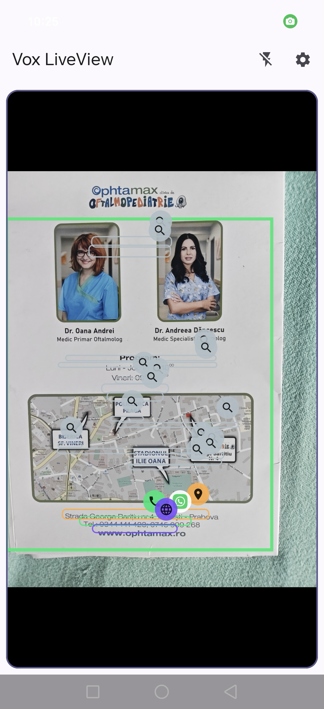
  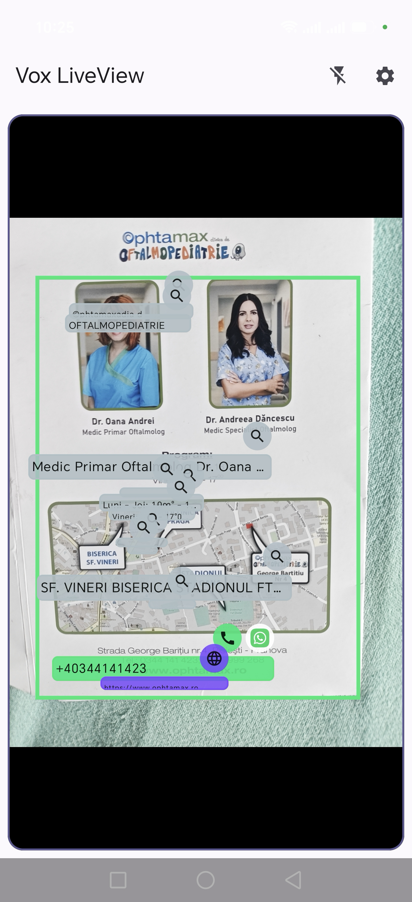
  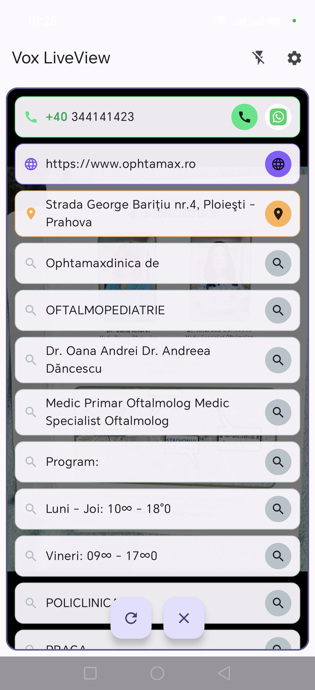

- Multi-language UI (English, Romanian, German, French)

## Vox Expenses

Standalone, encrypted on-device expense tracker (`com.voxapps.expenses`, Room + SQLCipher). Voice-created
through Commander (`create`/`read`), scanned from a receipt via Vox Vision, captured automatically from
bank/payment notifications, or entered by hand.

- **Three capture paths, one shape** — voice (`ExpenseParsePromptBuilder`), receipt OCR
  (`ExpenseScanCleanupPromptBuilder` — one focused cleanup pass extracting vendor, bank, and per-item
  net/VAT/gross when printed), and notification
  capture (`NotificationExpenseParsePromptBuilder` — a deliberately narrower extraction: title/amount/
  currency/vendor/category plus an `isPayment` triage flag, since notification text isn't guaranteed to
  even be a transaction) — all three route through Commander's generic LLM hook, just with different
  `task` IDs and prompts suited to how much structure each source actually has. All three enter and
  leave through the same shared template (`:core:recordflow`) — what differs is the question asked,
  not what happens to the answer
- **How much the model is asked to do is a setting, per path** — two questions rather than a list of
  names: how much of the capture is sent, and how much of the reply fills itself in versus waiting to
  be accepted. At the offline end nothing leaves the device and the record is made from what the page
  or the notification already proves; at the other end the model reads everything. The middle rungs
  are the ones that matter for a receipt, because line items are where a row reading 51,38 for 51,33
  is indistinguishable from a right one — so they can be offered rather than written. Each app draws
  only the rungs it can honestly keep
- **A scanned page is read before it is sent** (`:core:docread`) — the rows and the totals have to
  prove each other: a set of rows is accepted only when it sums, to the cent, to a figure the document
  itself prints. Where nothing closes, no items are emitted at all, because an empty list is a record
  you complete and an invented one is a record you must first notice is wrong. A document that prints
  several honest totals — a restaurant bill labels every suggested-tip column "Total", each above what
  was actually charged — is settled by that arithmetic rather than by taking the largest. An invoice's
  own charges and previous balance land as optional extra fields on the record
- **Rescan suggestions** — re-running OCR/AI cleanup on an already-saved expense (e.g. after attaching
  a clearer photo) never overwrites fields silently: each field the rescan corrected shows up as its
  own dismissible suggestion chip next to the current value, so you approve or reject them individually
  instead of trusting the whole rewrite at once. An **auto-rescan on first attachment** setting
  (Settings, off by default) triggers this automatically the moment a stub expense gets its first photo.

  

- **Many records at once** — long-press starts a selection; a checklist button in the bar flips
  between select-all and select-none, and the pencil opens the same edit layout over every selected
  record: fields that differ across the selection read "Multiple values" and only what you touch is
  written. The other two bar actions are archive — records leave every list, total and budget until
  restored, with a retention picklist and a red, five-second-armed permanent delete on the archive
  screen — and delete, behind the same countdown confirmation. The filter chip the list carries sits
  on Reports and the budget screen too, reading the same state.

  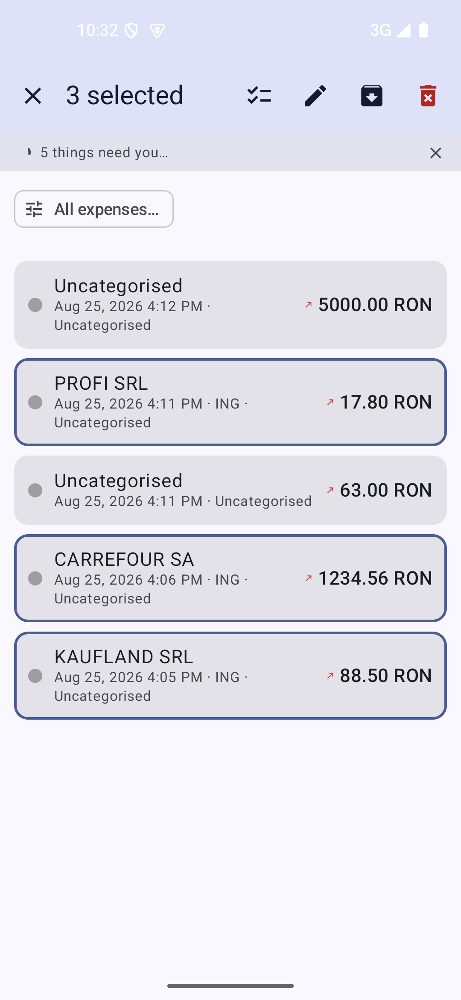
  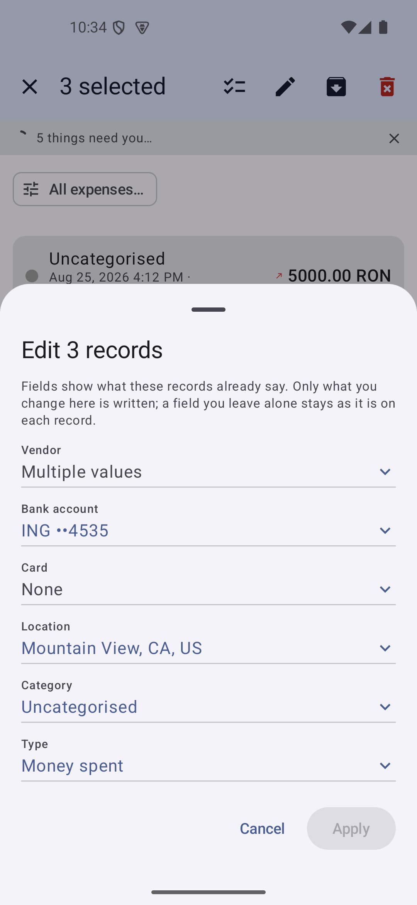
  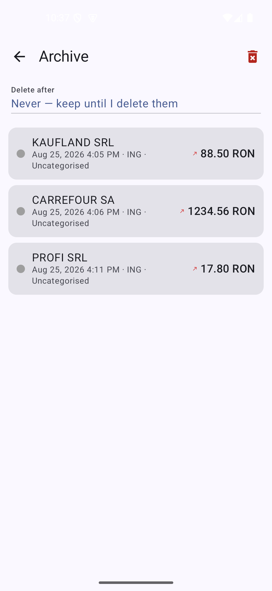

- **Notification capture** — an opt-in `NotificationListenerService` inspects notifications only from
  apps the user explicitly allowlists (Settings → Notification capture); a matched notification is a
  **pending suggestion** the user must approve or dismiss unless "Auto-accept" is enabled, in which case
  it's inserted directly (still a normal, editable expense row afterward, and still subject to the
  duplicate-rule engine below). The parsing prompt itself adapts to whichever LLM engine is currently
  active — see **Notification-parse prompt tuning** below. Notifications the listener missed (OS-killed
  process, dropped broadcast) get a "last chance" capture on dismissal, plus a manual "Force-check
  notifications now" button (debounced — a rapid double-tap can't dispatch the same notification twice)
  that bypasses the already-processed guard for whatever's still in the notification shade. The
  source-app allowlist picker is a shared `:core:apppicker` card (full-screen modal with Cancel/Done
  confirmation, search + all/user/system filter) backed by a persisted launcher-apps cache — scanned
  once ever, reloaded from cache on every later launch, with a manual "Rescan Apps" button for when a
  new app is installed (plus, on Honor/MagicOS devices, a warning and an App Info shortcut if the OEM's
  own "get installed apps" permission gate is silently emptying the scanned list despite
  `QUERY_ALL_PACKAGES` being granted, and a deep link into that OEM's own app-launch-management screen —
  independent of stock battery-optimization exemption — since it can otherwise block the listener from
  ever rebinding after the process is killed). Before any model runs, a deterministic pre-parse resolves what the notification's text already
  proves — amount (only when exactly one currency-marked figure exists), vendor (legal-form tokens),
  and bank (schema-served vocabularies) — and every field it resolves is removed from what the model
  is asked for. Independently, a learned **notification template** memory keys on the notification's
  byte-shape skeleton: once a human confirms what a template means (direction, is-it-a-payment),
  later notifications matching that exact shape reuse the verdict and skip the is-this-a-payment
  triage; a record teaches its template once, however often it's re-saved, and one contradicting
  confirmation quarantines the template for good. Learned templates are listed in Settings (Expense
  cleanup and rules → Notification templates), each with its skeleton text, status, confirmation
  count, and per-template Forget and Re-teach. The request to Commander is durably queued — see
  [Durable delivery: the pending-request queue](TECHNICAL_DOCUMENTATION.md#durable-delivery-the-pending-request-queue-voxllmrequestqueue)
  — so a notification is recovered automatically even if Commander was killed/stopped at capture time.
- **What a capture is allowed to do to the notification, and to itself** — a capture that resolves
  cleanly can dismiss the notification it came from (Settings, off by default). A message announcing a
  payment without a figure is normally nothing to keep, since an amount is what tells a payment from an
  advertisement — but some senders do leave the sum out, and an opt-in setting keeps those as review
  entries with the one missing figure asked for there. Where a template has taught nothing yet, an
  assumed direction can be chosen rather than waiting: it is safe to offer only because it is not final,
  since correcting the direction once is the confirmation that shape never had. A second announcement of
  a payment already filed is folded into the existing record upstream — same source, same currency,
  amount equal to the cent, within three minutes, and not hand-edited — rather than arriving as a
  duplicate to reconcile afterwards
- **Editable vocabularies** (Settings → Notification capture) — the banks, legal forms and merchants the
  deterministic pre-parse matches on. What the app supplies is listed apart from what this device added,
  either side can be switched off a term at a time or all at once, and a term switched off stays off
  across list reloads because the blacklist is keyed by the word rather than by its position. A term may
  not sit in two lists at once, which is the mutual-exclusion contract the pre-parse rules depend on.
  A name that is another spelling of one already accepted — matched against both the lists and the names
  on records you edited by hand — is offered as a *rename* rather than as a second list entry, shown as
  an amber chip because the app is asking rather than offering; accepting it writes an enabled re-map
  rule, so the spelling resolves by itself from then on and the record in front of you takes the
  accepted name too
- **Notification-parse prompt tuning** — the notification-capture prompt (`NotificationExpenseParsePromptBuilder`)
  branches on whether Commander's currently-active engine is local or cloud (queried once per capture
  via `VoxCapabilityClient.isLocalEngine`): a local engine gets the few-shot examples and a short
  anti-copy clause that exist specifically to work around a small on-device model's demonstrated
  tendency to leak literal example content into real output (backstopped by a deterministic code-side
  strip regardless of what the model does); a cloud engine, which doesn't share that failure mode, gets
  a shorter, example-free prompt instead of a padded-out copy of the local one.
- **Transaction direction** — every expense is tagged outgoing (money spent) or incoming (money
  received/refunded); Reports splits **Total** (outgoing only) from **Received** instead of netting
  them into one misleading figure. Voice/scan/notification parsing infers direction from the source
  text (e.g. "refund," a bank credit notification) and defaults to outgoing when ambiguous.
- **Duplicate detection** (Settings → Expense cleanup and rules → Duplicates) — a generic, user-configurable rule engine
  (`RuleBasedDuplicateChecker`, shared via `:core:datahygiene` — see
  [Generic duplicate-rule engine](TECHNICAL_DOCUMENTATION.md#generic-duplicate-rule-engine)), modeled on
  email-client filters: any expense field (title, vendor, bank, location, comments, amount, currency,
  category, direction, date/time) can be added to a named rule with its own AND/OR, multiple rules
  combine via one global AND/OR, and each rule independently chooses exact-vs-fuzzy string matching and
  a shared time window (1–15 min). Two default rules are pre-seeded reproducing the app's original
  behavior (same amount+currency+direction+time, plus title OR vendor).
  - **Automatic protection** (what runs on every insert) has four modes: **Off**, **Local** (silently
    merges an obvious rule match), **Local + AI** (local merge plus a small AI-scoped confirmation
    check queued for review), and **AI** (review-only, no local merge). A per-rule "applies
    automatically at save" toggle scopes which rules participate here vs. review-only contexts. The
    AI-scoped recall step for **Local + AI** (both automatic and manual/scheduled) uses the same
    configured rules to decide what's worth showing the AI, respecting your time window and field
    choices; pure **AI** mode has no local component and deliberately never consults the rules at all,
    recalling by a fixed amount/currency/direction match instead.
  - **Manual review** (only shown for Local/Local + AI) — when on, an insert-time local-rule match is
    added to the same pending-review list "Check for duplicates now" produces, instead of merging
    silently, so nothing changes without a look first.
  - One rule engine covers both exact and near duplicates — see the technical doc link for the full
    evaluation model.
- **Data-quality scoring for merges** — when two duplicates merge (silently, or approved from the
  review list), which record's data wins per field is decided by a score rather than arrival order: each
  expense is scored on how it was captured (Manual > Scan > Notification > Voice — manual entry is the
  most trustworthy, voice the most error-prone for proper nouns like vendor names) plus how many
  optional fields it actually has filled in, and a manually-edited record always outranks everything
  else. The review list's "keep" selection defaults to whichever group member scores highest (still
  overridable via the radio buttons) and shows each candidate's capture-source tag alongside its
  total/bank/vendor/date-time, so the default is explainable rather than a black box. Approving a
  review group backfills the kept row's blank fields from its higher-scoring duplicates before
  deleting them, instead of discarding that data outright.
- **Uncategorised, and how a category names itself** — records nothing classified fall back to a
  category that says so, seeded and starred rather than landing on whichever category happened to sort
  first: every capture with no opinion takes the fallback, so whatever holds that role is stamped on a
  great many records, and afterwards a stamped record cannot be told from one that genuinely belongs
  there. The starred category sits at the top of the settings list above a divider. Category names take
  one shape on the way in (`:core:datahygiene`'s `NameCasing`, cased against `Locale.ROOT` so a name
  syncs identically across devices), and a category may carry an icon — stored as text, which is why it
  survives into the widget, which renders no vectors of its own, and into a backup. The icon shows
  wherever a category names itself; where a row already has a slot for it — an expense card, a picklist
  entry, a widget line — it takes the coloured dot's place rather than sitting beside it
- **Category color adjacency + merchant category memory** — a freshly auto-created category's color is
  chosen to visibly differ from the most-recently-added expense's category (not just from the aggregate
  palette), and repeatedly correcting the same vendor to the same category (configurable 1×/3×/5×/10×
  streak, off by default) makes that mapping auto-apply to future captures for that vendor, overriding
  whatever the LLM/default would otherwise suggest — see **Category cleanup** below for the streak
  toggle's exact location.
- **Inline category creation** — the category dropdown on the expense-edit screen has a
  "+ New category..." entry that opens the picker described below without leaving the screen; the new
  category is selected immediately on save.
- **Line items & VAT** — optional per-item net/VAT/gross breakdown, shown only when enabled (most
  receipts don't carry this detail); a red warning banner appears if the total doesn't match the sum of
  line items, without blocking editing. Invoice records additionally carry two optional totals — the
  invoice's own charges and the previous balance — kept apart from the headline amount; both are null
  on every non-invoice record
- **Currency & exchange rates** — a default currency for new expenses, a separate home currency reports
  convert *into* when expenses mix currencies, and a locale-independent decimal separator setting (comma
  vs. period) so typed amounts round-trip correctly regardless of device locale
- **Cards and accounts** (Settings → Notification capture → Cards and accounts) — the card or account a
  record went through, read from the text itself rather than learned: an IBAN (ISO 7064 mod-97 verified),
  a full card number (Luhn verified), or a masked ending such as `••4535` or `**00`, which is what a
  payment notification usually carries. Both checksums are enforced because a receipt is full of digit
  runs that happen to be the right length — an order number, a till id. Nothing here is guessed,
  matched against a list or asked of a model, so unlike the bank and merchant vocabularies there is no
  supplied list, nothing to switch off term by term, and no proposal to accept: the format matches or
  it does not. A card is stored by its last four digits so the two a notification shows and the sixteen
  a receipt shows reach one account, and a card first met as a masked ending is *widened* rather than
  duplicated once a fuller reading arrives. A message naming two accounts — a transfer between your own
  — claims neither. Cards may sit under an account, one level deep and only where a person says so
  (never inferred: a document naming both is as likely a payment between them as a statement listing
  both), and each carries one currency, a name and an icon. Two independent switches decide whether an
  unfamiliar account may be added without being asked, one per source, because a scan is something you
  photographed and a notification arrives on its own
- **Recurring payments** (Settings → Recurring payments) — payments to the same vendor that keep coming
  back are counted, and an arrangement seen often enough is *proposed* rather than declared; how many
  sightings that takes is a setting. A confirmed arrangement shows its next expected payment as a dotted
  predicted row in the list, and a daily `WorkManager` job counts the cycles that went by and delivers
  reminders through the same `:core:design` notification card every other reminder in the suite uses.
  Predictions appear only in an unfiltered list — a filtered list is a question about what happened, and
  a payment that has not happened is not an answer to it
- **Spending limits** — per-category/per-period budget alerts, checked by a scheduled `WorkManager` job
  (`SpendingLimitCheckWorker`) and delivered as a system notification
- **Category cleanup** (Settings → Categories) — "Remember merchant categories" toggle + 1×/3×/5×/10×
  threshold chips (see above), plus the same Commander LLM-hook pattern as Vox Notes: auto-merge finds
  and merges near-duplicate categories, on-demand or on a schedule
- **Expense cleanup and rules** (Settings) — a sectioned submenu of four pages, each opening with a
  how-it-works card whose key words are colored by consequence (green = by your hand, amber =
  automatic, red = destructive):
  - **Duplicates** — automatic protection and the duplicate-rule engine (see **Duplicate detection**
    above), plus an on-demand **"Check for duplicates now"** button and a **scheduled** equivalent,
    both of which stage matches into the same pending-review list regardless of trigger — the
    Commander LLM-hook pattern, reviewed and approved per group before anything merges or deletes.
    Deleting a rule asks for confirmation first.
  - **Spelling corrections** — a field-correction memory (shared `:core:fieldmemory`) learns
    recurring one-word spelling fixes from your edits and re-applies them to future captures, either
    automatically or as dismissible suggestions (your choice), at a configurable learning speed; a
    word that ever receives two different fixes is treated as ambiguous and never touched again.
  - **Re-map rules** — WHEN/THEN rules over expense fields (shared `:core:datahygiene` engine): WHEN
    the fields you chose match a rule — each WHEN field with its own three-step fuzziness, colored by
    risk — THEN its other fields are set. Rules are authored by hand or proposed from your repeated
    edits and confirmed before they apply; your own rules always outrank learned ones, and deleting
    one asks first.
  - **Notification templates** — the learned template list described under **Notification capture**
    above.
- **Calendar view** (optional, off by default) — same shared `:core:calendar` module as Vox Notes, plus
  bank/vendor filters and an amount ascending/descending sort; sorting by amount isn't chronological, so
  it temporarily disables the calendar view (a dismissible chip restores it)
- **One filter control** — a single chip above the list naming every narrowing in force
  (`:core:design`'s `VoxFilterButton`), opening the filter sheet, and clearing everything from a ✕ that
  appears only when there is something to clear. A filtered list otherwise looks exactly like a short
  one, which is the difference between records missing on purpose and records missing. There is no
  Apply: every control reports as it is used, the date range included. Narrowings are category, bank,
  vendor, location, amount, card or account, currency, date range and sort — bank/vendor/location are
  searchable picklists built from the values the data actually holds, and the amount brackets are read
  from the smallest and largest amounts on file and rounded to numbers a person would have chosen
  (a fixed 0–50 bracket is every record for one person and none for another). Choosing an account
  reveals a second picker for its cards; an account answers for its cards too, since a notification
  names a card and never the account behind it. An account and a currency exclude each other — an
  account holds one currency — and whichever is not in force greys out rather than disappearing
- **Reports** — Total (outgoing)/Received split (see Transaction direction above) and by-category
  breakdowns, converted into the home currency. Reports carry the same filter control, reading the same
  state as the list, so a narrowing made in one holds in the other: a report answers a question about
  the records in front of you and must not quietly widen it back out. The period chips are the report's
  own question and stay separate
- **Category color picker** — shared `:core:design` component (also used by Vox Notes/Vox Calendar):
  a scrollable preset row with a clear ring around the selected swatch, plus a "Custom…" entry opening a
  full-screen color screen (Hue/Saturation/Value sliders, live preview, the same presets for a quick
  pick). Auto-generated presets sit at evenly-spaced hues so they're never visually close to each other.
- **Attach photo on scan / on retry** (Settings, off by default, independent toggles) — sends the
  receipt photo to the AI alongside the OCR text when Vision provided one and the configured engine
  supports images; retry (re-sending already-staged OCR text after a failed parse) is a separate
  toggle since it's a distinct, less frequent path
- **Attachments** — a collapsible thumbnail strip on every expense for extra photos beyond the
  original receipt scan (e.g. a warranty card, a second page); tap a thumbnail for a full-screen
  zoomable view, with an inline add/remove — same shared component as Vox Notes/Vox Calendar. Adding one
  offers **"Choose from gallery"** alongside the camera, plus the same **Single / Stitch / Batch**
  capture-mode chooser Vox Vision uses (see [Vox Vision](#vox-vision) above); removing one asks for
  confirmation first instead of deleting on the first tap. An expense with at least one attachment (the
  original scan or a manually-added one) shows a small paperclip icon right after its title, in both the
  in-app list and the home-screen widget.

  

- **Location** (Settings → General, shared `:core:location` module also used by Vox Commander) — the
  same cached-location/Home-town/"Always use this location" system described under
  [Vox Commander](#vox-commander) above, used here to prefill an expense's location field. The
  expense editor's location field itself is the shared `VoxLocationField` — inline
  OpenStreetMap/Nominatim search with an optional GPS lock — rather than a free-text box.
- **Backup & Restore** (Settings → Data → Backup & Restore) — back up expenses/categories/duplicate
  rules/settings to a file you pick, or restore from one, using the same zip format Vox Hub's own
  export/import produces; restoring offers **Full override**, **Merge**, or **Additive** reconciliation
  (see [Vox Hub](#vox-hub) below).

  

- **Home-screen widget** (Jetpack Glance) — recent expenses grouped by day, category-colored rows,
  tap an expense to edit it in place, plus Add/Scan actions
- **Battery-optimization exemption prompt** — Settings → Notification Capture and first-launch
  onboarding both offer a direct button into the OS's "ignore battery optimizations" dialog, since some
  OEMs' aggressive background-process killers can silently unbind the notification listener otherwise
- **"Today" particle-effect theming** and **custom notification controls** (Settings, shared `:core:design`
  components also used by Vox Notes/Vox Calendar) — see [Vox Calendar](#vox-calendar) below for what
  each does and a screenshot.
- Settings is grouped into labeled section banners (General/Appearance/Notifications/Data/Advanced),
  same shared pattern as every app in the family.

  

- **Peer-to-peer device sync** (paired from Vox Hub, see [Vox Hub](#vox-hub) below) — genuinely
  bidirectional sync with another phone over NFC + Bluetooth, no cloud; category-scoped, last-write-wins
  on a conflicting edit, deletions propagate via tombstones
- Multi-language UI (English, Romanian, German, French)

### The money model — bank, name, shop, currency, card, expense

What a record knows about money, and what points at what. The companion below follows what is
*left* to spend.

#### Rows in the database

    categories                bank_accounts                     account_budgets
      id                        id                                id
      name                      digits        <- the identity      accountId  --+
      colorArgb                 kind  IBAN|CARD|CARD_TAIL          currencyCode | unique
      icon                      parentId --+  one level only       amount       | together
      isDefault  <- fallback    label      |  a free alias         mode  PERIOD|POT
      position                  bankName   |  text                 period, startedAt
      createdAt                 currencyCode                       reconciledAt
                                icon, autoCreated                  reconciledRemaining
                                           |                                   |
                                 <---------+                        <----------+
    expenses
      id, uid
      totalAmount        \
      currencyCode        }  the facts — no rule rewrites these
      dateTime           /
      vendor      text
      bank        text
      location    text
      title, comments
      direction   OUTGOING | INCOMING
      categoryId      ----------------->  categories.id
      bankAccountId   ----------------->  bank_accounts.id   (the card OR the account, whichever was recognised)
      source  VOICE | SCAN | NOTIFICATION

**Vocabularies are not tables.** They live in settings (DataStore) plus a signed schema file, and
there are four: banks (76 supplied + yours - the ones switched off), legal forms, shops (yours only),
stop words. Their job is recognition inside a message, not storage.

**Currencies are not a table either.** `CurrencyCodes` in `:core:textmatch` holds the ISO codes and
the ways people write them. Settings hold three: the app's own currency, the currency of a new
expense, and the currency of new cards (which may say "from the capture").

#### What points at what

- **Expense -> account/card**: one id. A notification carrying `**4535` files it on the card, one
  carrying an IBAN on the account, and a message with no account format leaves it null.
- **Card -> account**: `parentId`, one level. A card with no parent *is* an account.
- **Budget -> (account, currency)**: unique per pair. An account holding RON and EUR carries two.
  Cards hold none: their spending comes out of the account family's budget.
- **Expense -> budget**: no stored link at all. It is derived on every read — same account family,
  same currency, inside the current window.
- **`expenses.bank` vs `bank_accounts.bankName`**: two fields, both text. The first is what that
  message said; the second is who the account is held with. A message can name either alone.

#### Where each value comes from at capture

| field            | source, in order                                                                   |
|------------------|------------------------------------------------------------------------------------|
| amount           | read from the text (figures marked by a currency)                                   |
| currency         | read 1:1 from the text -> what a model said -> the default                          |
| vendor / bank    | vocabulary (token-sequence match) -> model                                          |
| account/card     | `AccountIdentifiers` on the digits -> existing row, else created; auto-parented when that bank has exactly one account |
| category         | rules -> name resolution -> the fallback category                                   |
| budget           | nothing is written — it is recomputed                                               |

#### What each field offers in the UI

| field              | the list                                   | search also reaches        | "new" adds to      |
|--------------------|--------------------------------------------|----------------------------|--------------------|
| Vendor             | shops you have paid                        | your own shop vocabulary   | the vocabulary     |
| Bank (expense)     | banks your records and accounts name        | all 76 supplied + yours    | the vocabulary     |
| Bank (account)     | the same                                    | the same                   | the vocabulary     |
| Belongs to         | accounts that may be a parent               | —                          | creates an account |
| Currency           | codes the reader knows, your language first | —                          | —                  |

The rule applied throughout: **the list shows what you use; the dictionary stays one search away.**

### Budget flow, downstream

The same thing followed downstream: what holds the money, what draws on it, what is counted.

#### The chain

    BUDGET            one per (account, currency)          "1500 RON this month"
      |                account_budgets
      |
      v
    ACCOUNT           the row money lives in               ING, RO49...0000
      |                bank_accounts, parentId = null
      |
      +--> CARD       a way of reaching that account       ING **4535   (parentId -> account)
      +--> CARD       another way of reaching it           ING **9999
      |                cards hold no budget of their own
      v
    EXPENSE           filed against whichever row was recognised
                       expenses.bankAccountId + expenses.currencyCode

An expense filed on a card draws on its account's budget. An expense filed on the account draws on
the same budget. An expense filed on nothing (no account format in the message) draws on no budget
at all — and that is honest, not a gap: the app cannot say whose money it was.

#### What is stored, what is worked out

Stored is only the intent:

    amount                what the period grants, or what the pot was filled with
    mode                  PERIOD | POT
    period                WEEKLY | MONTHLY        (PERIOD only)
    startedAt             when the pot was filled (POT only)
    reconciledAt          when a statement was believed        (nullable)
    reconciledRemaining   what that statement said was left    (nullable)

**Nothing is ever decremented.** What is left is computed on every read:

    windowStart   = max( mode's own start , reconciledAt )
                      PERIOD -> the calendar's window (SpendingPeriod: this week / this month)
                      POT    -> startedAt

    opening       = reconciledRemaining ?: amount

    movement      = sum over expenses where
                        expense.bankAccountId is in the account's family (account + its cards)
                        AND expense.currencyCode == budget.currencyCode   (case-insensitive)
                        AND expense.dateTime >= windowStart
                    counting  -amount for OUTGOING, +amount for INCOMING

    remaining     = opening + movement
    spent         = opening - remaining

The alternative — a running figure decremented as records arrive — is wrong the first time a capture
is missed, edited or deleted, and stays wrong with nothing to notice it. Derived, whatever the
expense list says today is what the budget says today.

#### What counts, what does not

| a record …                              | counted? | why                                                     |
|-----------------------------------------|----------|---------------------------------------------------------|
| on the account                          | yes      | the money left there                                     |
| on a card under the account             | yes      | the card is a way of reaching that account               |
| on a card under a *different* account   | no       | different money                                          |
| in another currency the account holds   | no       | that currency has its own budget                         |
| dated before the window                 | no       | it belonged to the period that has closed                |
| dated before a believed statement       | no       | the bank had already subtracted it                       |
| incoming (refund, transfer in)          | yes, adds| money that came back into the same pot                   |
| on an archived card                     | yes      | it still left the account; archiving is a display fact   |
| with no account at all                  | no       | nothing says whose money it was                          |

#### Believing a statement

Most bank notifications state the balance left. Taking one is not an adjustment, it is a new
starting point:

    before:  1500 granted, we saw 3 payments, remaining 1080
    bank says "disponibil 1043.20" at 15:12

    after:   reconciledAt = 15:12, reconciledRemaining = 1043.20
             remaining = 1043.20 + (only what happens after 15:12)

Everything the app may have missed before that moment stops mattering from that moment. This is why
the pair is stored rather than the difference: a difference would have to be re-applied for ever,
while a starting point simply replaces what came before it.

#### Upward again: one figure for a glance

The widget header is the only place budgets are added together.

    OFF        nothing is drawn at all — a home screen is read on a lock screen and over shoulders
    TOTAL      every budget
    SELECTED   only the accounts ticked

    all budgets in one currency  ->  plain sum, stated in that currency, no rate involved
    mixed currencies             ->  each converted into the home currency
                                     a budget with no fetched rate is left out, never added as if
                                     it were already home currency
    nothing convertible          ->  no header rather than a wrong number

#### Two things next to each other that are not the same

**Budget** — per account and currency, a pot or a period, answers "how much is left to spend".
**Spending limit** — per category, per period, in the home currency, answers "tell me when I have
gone past this". They share a settings page (*Budget and spending limits*) and nothing else: one is
the plan, the other is the guard on it, and neither is computed from the other.

#### Worked example

    Account: ING, RO49...0000, RON              budget: 1500 RON, monthly
      card ING **4535 (archived on the 12th)
      card ING **9999 (issued on the 12th)

    Aug 3   LIDL          315.07 RON   on **4535     -> counted    remaining 1184.93
    Aug 9   refund         50.00 RON   on **4535 in  -> counted +  remaining 1234.93
    Aug 12  card replaced, **4535 archived                          nothing changes
    Aug 14  BRISTOL MED    60.00 RON   on **9999     -> counted    remaining 1174.93
    Aug 15  bank states "1043.20 available"                        opening becomes 1043.20 at Aug 15
    Aug 20  SIMARSI       108.13 RON   on **9999     -> counted    remaining  935.07
    Aug 24  EUR purchase   12.00 EUR   on **9999     -> not counted (the account's EUR budget, if any)
    Sep 1   the window rolls over                                   remaining 1500.00 again

#### What was deliberately not built

- **No budget per card.** Two cards on one account spend the same money; two budgets over it would
  count that money twice, and the sum of all budgets would stop meaning anything.
- **No automatic budget from past spending.** What you meant to spend is a decision, not an average.
- **No rewriting of an expense's account** when a card is archived or re-parented. The record says
  which card paid, because that is what happened.

## Vox Calendar

Standalone, encrypted on-device calendar (`com.voxapps.calendar`, Kotlin/AGP namespace
`com.voxapps.calendarapp` to avoid a dex-merge clash with the reused `:core:calendar` module — see its
own doc comment). Voice-created through Commander (`create`/`read`) or used entirely on its own.

- **Arriving in a month lands on a day of that month** — the first of it, except the month holding
  today, which lands on today. The day-of-month carried over from the month just left is a date
  nobody chose, and it decides what the agenda below shows. One rule
  (`:core:calendar`'s `CalendarDateUtils.dayToLandOn`) read by both the collapsed and the expanded
  view, so swiping months and scrolling the grid agree; shared with Vox Notes and Vox Expenses,
  which use the same module for their optional calendar view
- **Year / Month / Week / Day views** behind a collapsible sidebar; Month reuses the shared
  `:core:calendar` engine, Week/Day are a new local hour-of-day grid, Year is 12 compact mini-months. Day
  view draws a red **"now" line** at the current time-of-day position and auto-scrolls to land near it
  on first open — the same "now" concept the ToDo timeline and home-screen widget also show (see below).
  Once nothing's left for today, a **"Nothing else today"** label shows up right after the now-line (Day
  view, the ToDo timeline, and the home-screen widget alike), bracketed by a time-of-day emoji pair
  (☕/☀️ morning-day, 🍵/🌅 golden hour, 🌙/✨ night) that stays in sync across all three.

  
  

- **Colored, named layers** (e.g. Personal / Work / Moon Calendar) instead of a hierarchical
  category tree — flat layers plus optional flat tags, each layer independently toggleable and
  color-coded via the same shared `:core:design` picker Vox Expenses/Vox Notes use (scrollable
  presets, clear selection ring, "Custom…" full-screen HSV picker with live preview). Typing a new tag
  on an entry shows an inline **tag-suggestion** card of previously-used tags, expanding directly above
  the input rather than a popup, and stays open so several tags can be added in one pass.

  

- **Natural-language event/task creation via Commander** — "dentist in a week" resolves the date
  entirely through the LLM (no local date-NLU), picks the right layer by name (exact match → fuzzy
  match via `:core:textmatch` → configurable default), and works for both timed events and due-date
  tasks
- **ICS import/export** (Settings → ICS import/export) via the `biweekly` library — spec-correct
  interop with Google Calendar/Thunderbird/Apple Calendar, independent of the Hub JSON backup path
- **Day-summary sheet** — tapping a day shows that day's Calendar entries plus Notes/Expenses inline
  (a day-scoped `OP_READ` extension to the Vox contract), every row styled and colored the same way as
  the home-screen widgets and directly tappable into that record's editor; a Notes/Expenses section is
  omitted entirely (not shown empty) when that app isn't installed, checked locally before ever
  attempting the cross-app fetch. The reverse direction (Notes/Expenses → open Calendar on a date) uses
  a plain explicit-intent extra, not the broadcast bus
- Recurrence is deliberately minimal (none/daily/weekly/monthly/yearly + optional until-date, expanded
  at read time; a weekly recurrence picks which weekdays it falls on) — no RRULE engine, no per-occurrence materialized rows, editing a series edits the
  whole thing
- **ToDo Lists** — a dedicated checklist system alongside the calendar proper, reached via its own icon
  on the Calendar screen's header. Create any number of named lists, each a flippable card (tap to flip
  between a view face and an edit face) holding a vertical timeline of items:
  - An **"Important" star** marks an item with a 5-point-star node instead of a plain circle.
  - A **finished item is flat grey behind a flat black outline** — never a faded or washed version
    of its own colour. A tint of that colour says "still that item, quieter", so a list of finished
    items read as a list of dimmed ones; carrying no hue at all says the item is spent. The
    row-level fade that marks a past item is not applied to a done one, since it now says the same
    thing twice at the cost of legibility — an overdue-but-unfinished item still fades, which is
    what that was for. Border weight is set by importance and never by doneness, so a starred item
    keeps its heavy contour on both sides of the checkbox (`:core:design`'s `VoxSemanticColors`).
  - The single most-imminent undone item gets an **"Up Next"** marker — a bigger, gently pulsing node
    with a rotated label.
  - A **"Now" splitter line** divides past-due items from upcoming ones in the same list, the same
    concept as Day view's now-line.
  - Items **bleed into the Month/Day calendar grid and the home-screen widget** as the same star/circle
    markers, so a checklist due-date shows up right alongside real calendar entries without being a
    separate, easy-to-forget screen.
  - **Scan-to-item** — a document-scan icon on a list's edit face sends a photo through Vox Vision's OCR
    and Commander's cleanup LLM straight into a new checklist item.
  - Per-list and per-item **color pickers** (a vertical swatch strip for lists, the same shared picker
    used elsewhere for items) and a due-date/time quick-picker with reminder-offset presets. Editing
    happens in an **inline editor** that expands in place on the item's own timeline node (title,
    color, Done, Important, due date/time, reminders), with a node-colored contour marking the open
    row; opening another node saves and closes the current one, and deleting an item asks for
    confirmation first.
  - A list can be a **routine** on chosen weekdays: at midnight of each selected day its undated
    items' done flags reset, so the same checklist serves every day it applies (idempotent per local
    day, so a missed midnight catches up once).
  - Each item can carry photo **attachments** — a single-shot capture with no OCR pass, for a picture
    that is the item's content rather than text to read.
  - Each item (and each calendar entry — the entry editor has the same field) takes a location via
    the shared `VoxLocationField`: inline OpenStreetMap/Nominatim search plus an optional GPS lock.
  - Dedicated **to-do home-screen widgets**, in two forms: all lists, or a single list pinned at
    widget-placement time via a configure screen; tapping an item deep-links straight into its
    inline editor.

  
  
  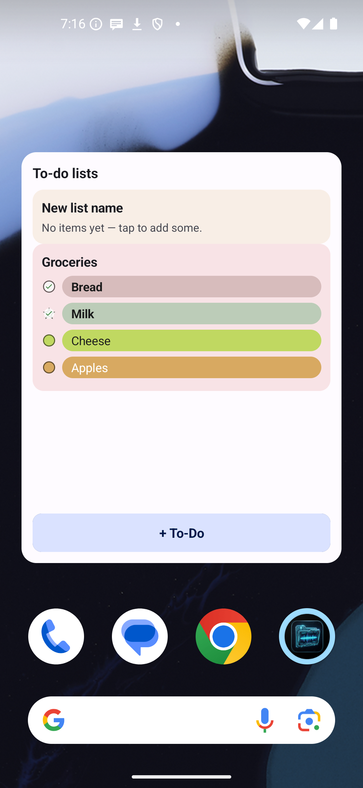
  
  
  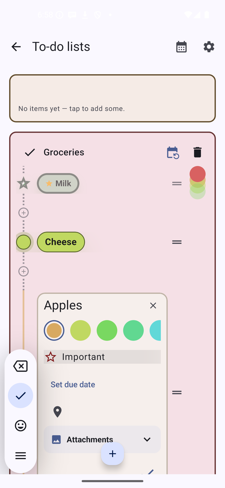
  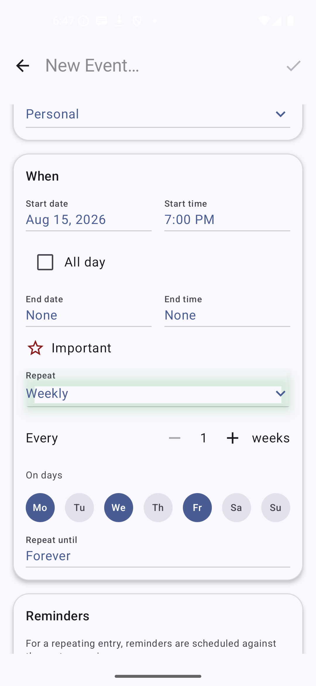
  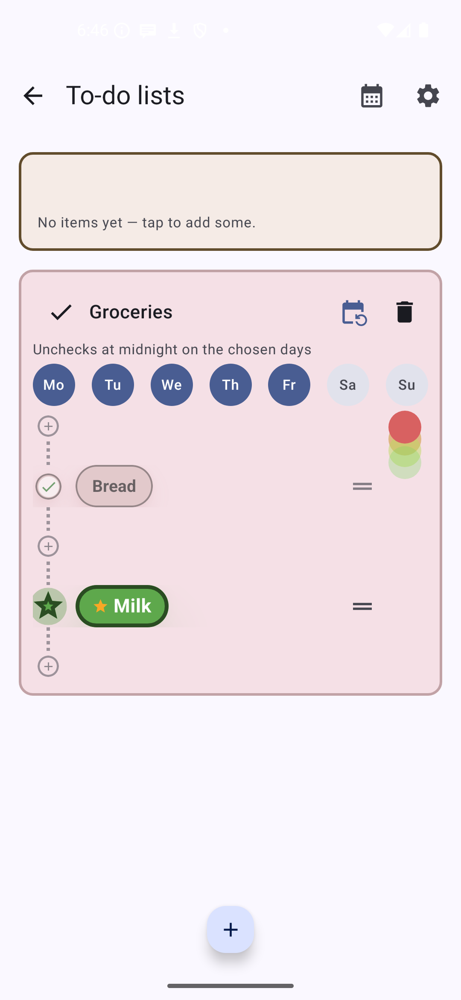

- **Attachments** — a collapsible thumbnail strip on every entry for extra photos (e.g. a ticket, a
  booking confirmation); tap a thumbnail for a full-screen zoomable view, with an inline add/remove.
  Adding one offers **"Choose from gallery"** alongside the camera, plus the same **Single / Stitch /
  Batch** capture-mode chooser Vox Vision uses (Stitch live-joins several overlapping shots of one
  document, Batch defers OCR on a batch of photos until the session ends) — the "add" tile opens a
  chooser dialog rather than jumping straight to the camera. Shared component, same on Vox Notes/Vox
  Expenses. An entry with at least one attachment shows a small paperclip icon right after its title, in
  the calendar grid, the ToDo list, and the home-screen widget alike (see
  [Vox Expenses](#vox-expenses)'s screenshot for what this looks like).

  

- **Backup & Restore** (Settings → Data → Backup & Restore) — back up events/layers/ToDo
  lists/settings to a file you pick, or restore from one, using the same zip format Vox Hub's own
  export/import produces; restoring offers **Full override**, **Merge**, or **Additive** reconciliation
  (see [Vox Hub](#vox-hub) below).

- **"Today" particle-effect theming** (Settings → Theme, `:core:design`'s `TodayEffects`, shared with
  Vox Notes/Vox Expenses) — an animated Canvas particle highlight on the current day, with five presets
  (Fire, Glow, Waves, Rainbow, Neon Pulse) and a choice of emission style (a ring, the background, or
  full-card).

  

- **Custom notification controls** (Settings, shared with Vox Notes/Vox Expenses) — choose the
  notification sound (system default or any ringtone via the system picker), volume, vibration on/off,
  and playback length, with an in-settings preview.

  

- Settings is grouped into labeled section banners (General/Appearance/Notifications/Data/Advanced) —
  cosmetic, but shared across every app in the family (Notes, Expenses, Calendar, Vision, Hub).

  

- **Home-screen widget** (Jetpack Glance) — upcoming entries grouped by day (today bolded, its
  divider thicker), layer-colored rows with tag chips, tap an entry to edit it in place, plus
  Add/Scan actions; the dedicated to-do widgets above are separate widgets alongside this one
- **Peer-to-peer device sync** (paired from Vox Hub, see [Vox Hub](#vox-hub) below) — genuinely
  bidirectional sync with another phone over NFC + Bluetooth, no cloud; layer-scoped, last-write-wins
  on a conflicting edit, deletions propagate via tombstones
- Multi-language UI (English, Romanian)

## Vox Hub

A lightweight, database-free backup/restore utility (`com.voxapps.hub`) — not a voice-command
satellite (it registers no NLU domain), just an IPC *client* over the same `:core:ipc` contract every
other satellite implements as a server.

- **Zero hardcoded app list** — at launch it calls `VoxAppsDiscovery` to find every installed Vox app
  that advertises `export`/`import` in its manifest meta-data; a new satellite (like Vox Calendar) shows
  up automatically with no Hub-side code change
- **Export** — one card per discovered app with four independent toggles (**Settings**, **Data**, **API
  keys**, **Attachments** — Data/Attachments only shown for apps that actually have record data, e.g.
  not Commander), plus an **All** toggle that sets every toggle for every app at once; bundles every
  selected app's exported JSON — and, when its Attachments toggle is on, that app's photo attachments —
  into one dated zip via `ActivityResultContracts.CreateDocument`. This exact configuration is also
  what **scheduled backups** use (see below) — there's no separate data-selection step for those
- **Import** — reads a previously exported file, previews a per-app record-count summary before
  anything is written, and lets the user deselect individual apps; each target app reconciles its own
  records against the import per one global **Import mode** (see below) and re-attaches any bundled
  photos to the newly-restored records
- **Import mode** (Settings → Backup schedule) — one global choice of how every app reconciles an
  imported file against what's already on it: **Full override** (delete everything that app already had,
  then insert the import), **Merge** (only delete pre-existing rows older than the backup, so anything
  created since is kept), or **Additive** (never delete, only insert — the import just adds to what's
  already there). Still respects each app's own Data toggle above — an app with Data off is skipped for
  import entirely, regardless of this setting. Every satellite app's own local Backup & Restore screen
  (see e.g. [Vox Expenses](#vox-expenses) above) has this exact same 3-way choice for its own restore
  button, independent of Hub's global setting. The caveat of whichever mode is selected is stated
  right where it's chosen — beside Hub's restore control and beside every app's own restore button.

  
  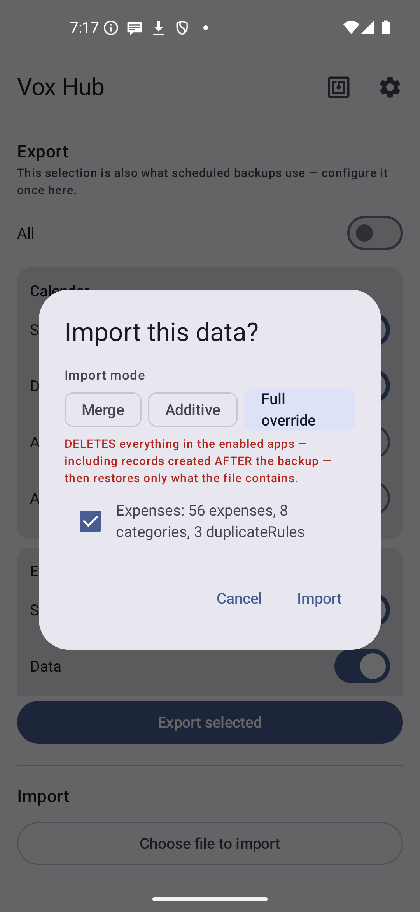

- **Scheduled backups** — off/daily/weekly/monthly interval (`WorkManager`), configurable retention
  (none/2/5/10/unlimited, with a storage-growth warning at unlimited), a dismissible failure banner
  when a scheduled run doesn't complete, and a past-backups list (capped to 5 visible rows, scrollable)
  with per-backup **Share** and **Restore** actions. Frequency/retention controls are disabled until at
  least one app has something selected in the Export card above — there's nothing to schedule otherwise
- **Backup & Restore, everywhere** — Notes, Expenses, Calendar, and Commander each have their own local
  Backup & Restore screen too (see each app's own section above) — save to or restore from a file you
  pick directly in that app, using the exact same zip format Hub's export/import produces, so a file
  saved from one path is importable via the other. Hub itself also has one, for its own settings.
- **Peer-to-peer device sync** — a second, genuinely *bidirectional* path alongside export/import's
  one-directional restore: pair two phones over NFC (tap to exchange identity + a session key — no
  Bluetooth PIN dialog), then sync Notes/Calendar/Expenses over Bluetooth Classic, both phones ending up
  with each other's changes, not one overwriting the other. Trigger a sync by tapping again, from a
  manual **Sync now** per paired device, or leave **Auto-sync** on for a background check every 15–240
  minutes (configurable). Per-peer category/layer checklist controls what's included. See
  [`TECHNICAL_DOCUMENTATION.md`'s Peer-to-peer device sync section](TECHNICAL_DOCUMENTATION.md#peer-to-peer-device-sync-op_sync_export--op_sync_merge)
  for the full architecture.
- **VoxConnect** — a QR-paired bridge to a PC companion (`core/voxconnect`): the *phone's* camera scans
  a QR code the desktop app displays (not the other way around, since most desktops have no camera) to
  exchange identity, then a foreground bridge service keeps the phone reachable for the PC side;
  schema-driven field discovery lets the PC app introspect what a paired phone can do without a
  hardcoded contract per feature, and a paired device can be renamed for easy identification when
  managing more than one.

  
- Settings is grouped into labeled section banners (General/Appearance/Integrations/Advanced), same
  shared pattern as every app in the family.

  

- Holds no local Room database for its own app data — sync's paired-device identities/keys are the one
  exception, kept in `EncryptedSharedPreferences`; everything else it persists itself is UI preference
  (theme, backup schedule)
