# Vox Apps — Feature Reference

Detailed feature-level documentation for every app in the VoxApps monorepo — Vox Commander and its five
companion apps — moved out of the top-level [`README.md`](../README.md) to keep that file a short,
non-technical overview. For the architecture behind how these apps talk to Commander and each other (the
cross-app contract, `:core:ipc`, discovery, routing, day-linking, etc.), see
[`TECHNICAL_DOCUMENTATION.md`'s §19 Vox Apps Ecosystem](TECHNICAL_DOCUMENTATION.md#19-vox-apps-ecosystem-cross-app-contract).
For building a new satellite app from scratch, see [`SATELLITE_APP_GUIDE.md`](SATELLITE_APP_GUIDE.md).

## Vox Commander

Standalone, on-device voice assistant (`com.voxapps.commander`) — the "core" app the rest of the
ecosystem plugs into, though it works completely on its own with no companion apps installed.

- **Wake word** — always-on listening via Vosk, Picovoice Porcupine, or the fully open-source
  OpenWakeWord (ONNX-based); an **External Trigger** toggle also lets automation apps (MacroDroid,
  Tasker) start a listen without the wake word at all, via the broadcast action
  `com.voxapps.commander.TRIGGER_VOICE` (Settings → App Manager).
- **On-device Whisper STT** (Whisper.cpp/GGML) with multilingual model downloads, and **Piper TTS**
  (on-device neural voices) alongside standard Android TextToSpeech — both configurable in Settings →
  Service, which also has speech rate/pitch sliders and an audio-focus choice for what happens to other
  media while Commander talks (ignore it, lower its volume, or pause it).
- **Command pipeline** — every spoken command is processed in this order:
  1. **FastMap rules** (see below) — instant, free, entirely offline pattern matches you define
     yourself. Plain keyword/regex matching, not AI. If one fires, nothing else runs.
  2. **AI Intent Translator** (Settings → AI & Models → Intent Engines) — the actual AI step, reached
     only when no FastMap rule fires: your choice of a cloud LLM (OpenAI), Gemini Nano running
     natively on-device, Gemini Cloud, or an on-device LLM running via **LiteRT-LM** (migrated from
     MediaPipe GenAI for broader model compatibility and better performance).
  3. **Offline fallback** — a *separately*-configured backup engine+model used only if the AI step
     above fails or is unreachable (skipped automatically if it'd be identical to it).

  
  

- **FastMap Rules Manager** (Rules Manager screen) — build instant, deterministic voice shortcuts that
  skip the AI entirely. Speak or type a sample phrase, then tap individual words to mark them as
  **Trigger** words (when the rule activates) or, depending on mode, **Search term** words (the argument
  passed to whatever gets launched). "Add Alternative Trigger" lets one rule respond to several different
  phrasings at once (OR logic — any group matching fires the rule). A 3-way **Search term & trigger
  mode** selector controls how the query is produced and how strictly the trigger phrase has to match:
  - **Manual** — you pick the exact query words yourself.
  - **Auto-extract** — whatever's left over after the trigger words becomes the query automatically
    (good for "play &lt;anything&gt; on spotify"-style rules).
  - **Any word order** — the trigger words can appear in any order in what you say (e.g. "turn on the
    flashlight" and "turn the flashlight on" both match the same rule). This is mutually exclusive with
    Auto-extract by design: an any-order match is built from zero-width regex lookaheads, while
    auto-extract needs to consume the trigger text left-to-right to know what's "left over" — combining
    both would silently corrupt the extracted query, so the UI presents these as one 3-way choice rather
    than two independent checkboxes.

  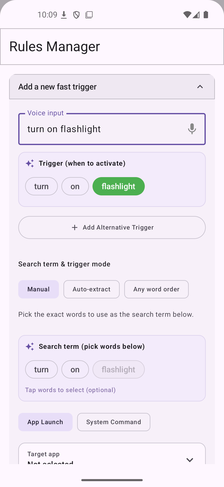

  A rule can either **launch an app** (pick a target app + one of its supported intent actions — play a
  search, open the camera, dial a number, etc.) or fire a **system command**. System commands cover 11
  actions: Volume Up/Down, WiFi/Bluetooth/GPS/Airplane-Mode/NFC (each a simple toggle — Android doesn't
  allow third-party apps to flip these silently, so the rule opens the relevant system settings panel),
  and **Flashlight/Do Not Disturb/Auto-Rotate/Silent Mode**, each with explicit **on / off / toggle**
  actions (matching the existing Volume Up/Down pattern) rather than one ambiguous action that has to
  guess direction from free text. Audio system commands (Play/Pause/Next/Prev) additionally offer a
  **Media Control Type** choice — Active Session, a pinned Default App, or physical Audio Button
  semantics.

  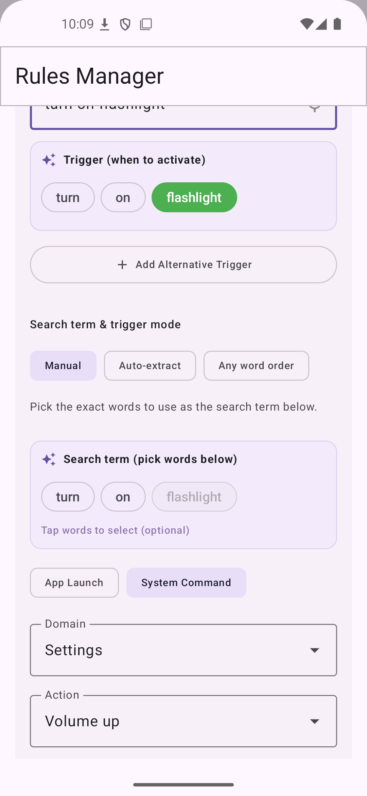

  Saved rules are searchable/filterable, drag-to-reorder (first match wins, so order matters when rules
  could overlap), individually switchable active/inactive, and bulk-activatable/deactivatable. Closing
  the Rules Manager with an unsaved, in-progress rule prompts a confirmation (Cancel / Discard / **Save
  &amp; Close**) instead of silently losing your work.

  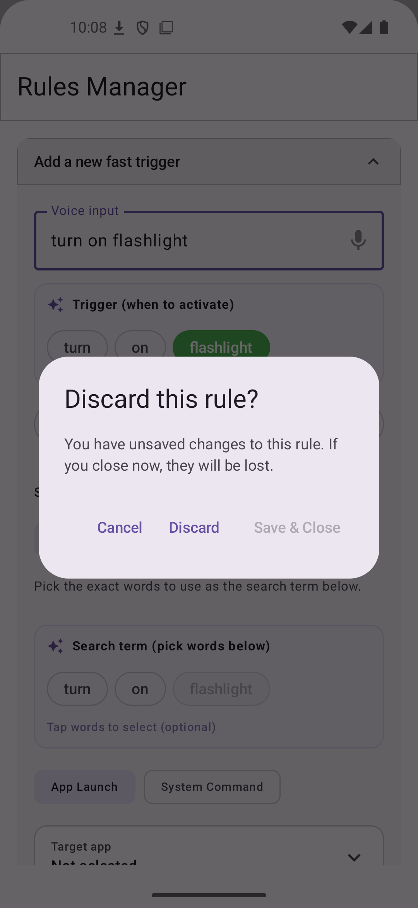

- **App Manager** (Settings → App Manager) — two related but independent mechanisms:
  - **Default apps per category** — Audio/Maps/Messaging plus any custom category you add; check every
    candidate app, then star one as the default used when a command doesn't name a specific app (e.g.
    "play some music").
  - **App Aliases** — define a nickname that always routes to one specific installed app regardless of
    its real name (e.g. saying "youtube" launches a YouTube-frontend app like LibreTube instead). An
    alias is resolved *before* category defaults, so it always wins over whatever's starred.

  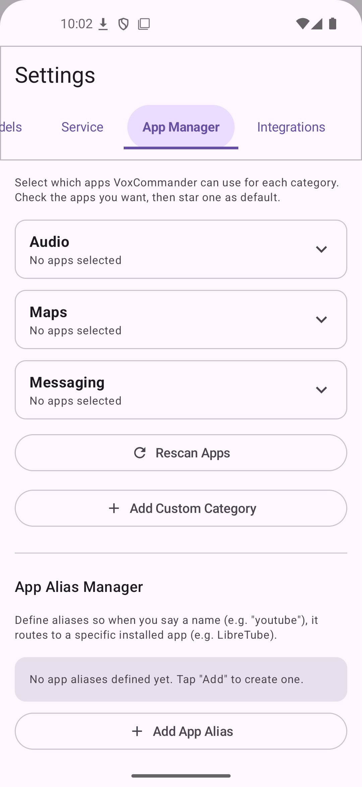

  The same tab also has a Media Session permission switch (needed to control playback in apps like
  Spotify), a "Return to previous app after action" app list, and the External Trigger toggle mentioned
  above.
- **Settings** — 8 tabs: General, AI & Models (Voice Engines + Intent Engines sub-tabs), Service (Wake
  Word + TTS sub-tabs), App Manager, Integrations (Spotify, discovered Vox Apps with per-app contract
  test, Piped/YouTube media, Search provider config), Permissions, Advanced (debug log viewer, engine
  benchmark, download preferences), and Theme (dark/light/system + a colored-surface option, shared with
  the companion apps).

  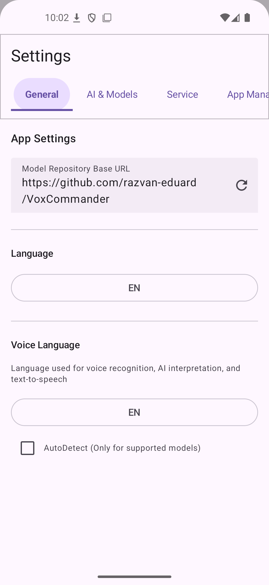

- **Media control** — search/play/pause/next/prev for Spotify, YouTube, or whatever's assigned as your
  audio default; **navigation** via Waze or Google Maps deep links; **messaging** through whichever app
  is resolved as your Messaging default or alias (WhatsApp/Telegram/SMS are common examples, not a fixed
  list — any messaging app assigned to that category works, using its own share/deep-link format where
  one exists); **search** across DuckDuckGo, Wikipedia, Google News, GNews, Currents API, NewsAPI,
  WeatherAPI, Open-Meteo, and OpenAI itself as a general/knowledge fallback.
- **Vox Apps ecosystem** — companion apps (Notes, Vision, Expenses, Calendar, Hub) are discovered
  automatically once installed and controllable by voice with no extra setup; Settings → Integrations has
  a live panel listing discovered apps with a per-app contract-verification test.
- **Location** (Settings → Integrations, shared `:core:location` module also used by Vox Expenses) — a
  cached last-known location with a configurable expiry (None/1 day/1 week/1 month/Forever), a **Home
  town** fallback used whenever GPS is unavailable and nothing's cached, and an **"Always use this
  location"** toggle that skips GPS entirely and clears any cache, for a fixed search/weather location
  regardless of where the device actually is.

  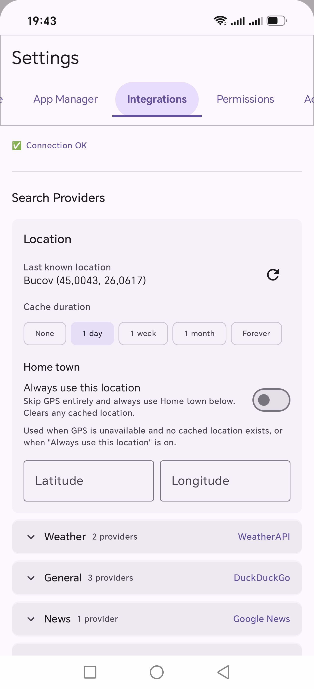

- **Bring your own model** — any engine that reads a model file accepts one you supply, listed as a
  row beside the downloadable ones: chosen the same way, deleted by the same trash icon, and shown
  with its real size. The file picker is filtered to the kind that engine expects, vendor archives are
  unpacked for you, and a file that isn't what the engine needs is refused *with the reason* rather
  than failing later — after which you're offered the deletion of the archive it came from. For
  engines that keep a model per language (Vosk), the language is asked at import.
- **Schemas are served from a repository, and signed** — the JSON that defines engines, search
  providers, intents and normalisation is fetched at launch while *Check for updates* is on, so
  corrections arrive without an app update. Because those files say where requests go, a change from
  the official repository is only adopted if it carries a valid signature; the app ships a public key
  and refuses anything else. Point the app at your own fork and your schemas are still used — marked
  *unverified*, since only the maintainer can sign. The bundled copies are always one tap away.
- **Backup & Restore** (Settings → Backup tab) — back up FastMap rules and portable settings to a
  file you pick, or restore from one, using the same zip format Vox Hub's own export/import produces;
  restoring offers a choice of **Full override**, **Merge**, or **Additive** reconciliation (see
  [Vox Hub](#vox-hub) below for the full explanation, shared by every app in the family).
- Multi-language UI (English, Romanian, German, French).

## Vox Notes

Standalone, encrypted on-device notes app (`com.voxapps.notes`, Room + SQLCipher). Voice-created
through Commander (`create`/`read`) or used entirely on its own.

- **Categories** with a coverflow-style picker; **Auto-Merge Categories** asks Commander's LLM hook to
  find and merge near-duplicate categories (e.g. "Shopping" / "Groceries")
- **Note cleanup** — the same LLM hook finds near-duplicate/redundant notes, but unlike category
  merge this only *proposes* groups (kept note + duplicates); the user reviews and taps **Apply
  selected** before anything is deleted — nothing is ever auto-deleted
- Both triggers are available **on-demand** and on a **schedule** (off/daily/weekly/monthly)
- **Scan-to-note** — receives raw OCR text from Vox Vision, sends it through the LLM hook to get a
  clean title/body and a suggested category, then creates the note
- Editor UI: tap a note's title to expand/collapse it in place (collapse via a dedicated chevron
  above the title, separated from the body by a shaded header)
- **Calendar view** (optional, off by default) — a month-paged agenda view (shared `:core:calendar`
  module) instead of the plain chronological list, with a peek into the tail/head of adjacent months
  and a "Today" button; month/weekday names follow the app's own language setting, not the device locale

  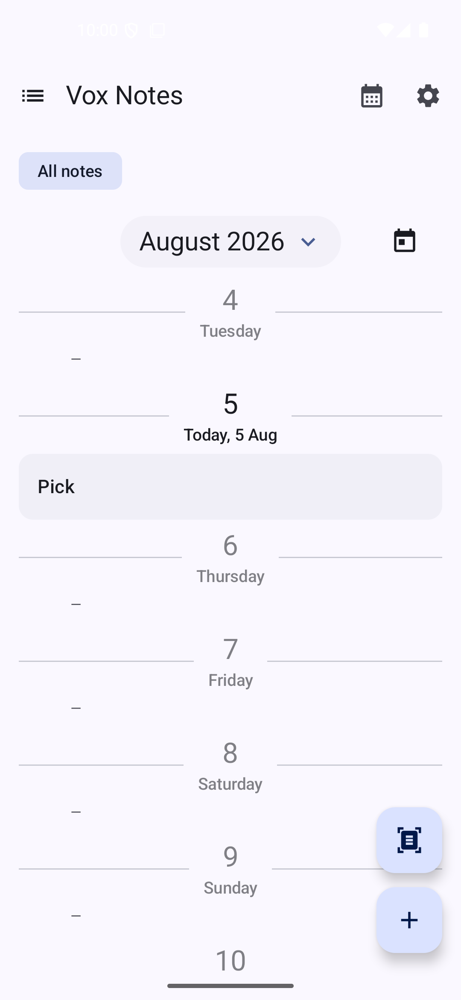

- **Category color picker** — shared `:core:design` component (also used by Vox Expenses/Vox
  Calendar): a scrollable preset row with a clear ring around the selected swatch, plus a "Custom…"
  entry opening a full-screen color screen (Hue/Saturation/Value sliders, live preview, the same
  presets for a quick pick). Auto-generated presets sit at evenly-spaced hues so they're never visually
  close to each other. The note editor's category coverflow has a trailing "+" entry that opens this
  same picker inline, creating and immediately selecting the new category without leaving the note.
- **Attach photo on scan** (Settings, off by default) — sends the scanned photo to the AI alongside
  the OCR text when Vision provided one and the configured engine supports images; Notes has no
  retry/stub mechanism, so unlike Vox Expenses there's no separate on-retry toggle
- **Attachments** — a collapsible thumbnail strip on every note for extra photos beyond whatever scan
  (if any) created it; tap a thumbnail for a full-screen zoomable view (pan/zoom disabled on the
  thumbnail itself, enabled in the full view), with an inline add/remove. **Scan image retention**
  (Settings, default "on failure") independently controls whether the original scanned photo itself
  survives as an attachment: off, only when Commander's cleanup pass fails outright (so an otherwise
  unusable "Unclear Document" scan becomes a raw note holding just the photo instead of being lost),
  or always. Adding an attachment now offers **"Choose from gallery"** alongside the camera, plus the
  same **Single / Stitch / Batch** capture-mode chooser Vox Vision uses (see
  [Vox Vision](#vox-vision) below). A note with at least one attachment shows a small paperclip icon
  right after its title, in both the in-app list and the home-screen widget (shared across Notes,
  Expenses, and Calendar — see [Vox Expenses](#vox-expenses)'s screenshot below).
- **Backup & Restore** (Settings → Data → Backup & Restore) — back up notes/categories/settings to a
  file you pick, or restore from one, using the same zip format Vox Hub's own export/import produces;
  restoring offers **Full override**, **Merge**, or **Additive** reconciliation (see
  [Vox Hub](#vox-hub) below).
- **"Today" particle-effect theming** and **custom notification controls** (Settings, shared
  `:core:design` components also used by Vox Expenses/Vox Calendar) — see
  [Vox Calendar](#vox-calendar) below for what each does and a screenshot.
- Settings is grouped into labeled section banners (General/Appearance/Notifications/Data/Advanced),
  same shared pattern as every app in the family.

  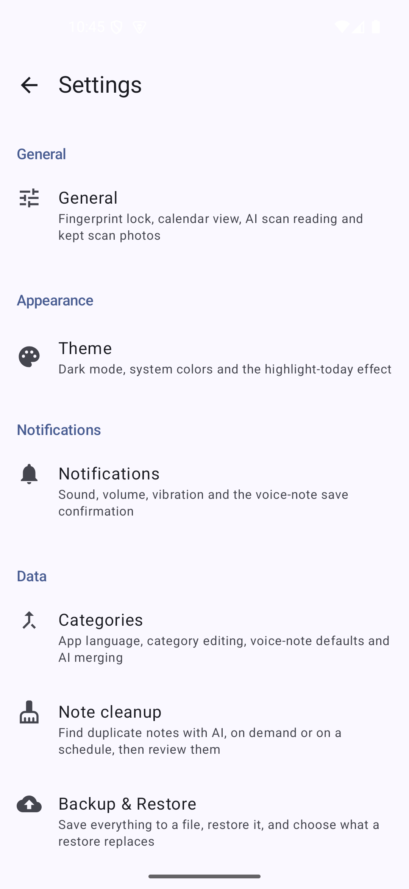

- **Home-screen widget** (Jetpack Glance) — recent notes grouped by day, category-colored rows, tap a
  note to edit it in place, plus Add/Scan actions — reads the same reactive state as the in-app UI, so
  a biometric-locked session shows locked here too
- **Peer-to-peer device sync** (paired from Vox Hub, see [Vox Hub](#vox-hub) below) — genuinely
  bidirectional sync with another phone over NFC + Bluetooth, no cloud; category-scoped, last-write-wins
  on a conflicting edit, deletions propagate via tombstones
- Multi-language UI (English, Romanian, German, French)

## Vox Vision

Standalone document scanner (`com.voxapps.vision`, `com.voxapps.vision.VisionActivity`) — no voice
commands in, only OCR text out.

- **Camera capture** (CameraX) with a live overlay of the detected document bounds
- **Auto-capture** — a throttled `ImageAnalysis` pass runs Otsu-threshold brightness-blob detection
  (deliberately not the stricter quad detection used for the final crop, since a document extending
  past the frame edge can't close into a 4-sided contour) and auto-triggers a capture once the bounds
  are stable; sensitivity is user-configurable (low/medium/high). Corner/edge detection has since moved
  to a dedicated on-device ML model (**DocQuadNet-256**) for the final crop quad, more robust on
  cluttered backgrounds and skewed angles than the original pure-OpenCV heuristics.
- **Edge cropping** — the final captured frame is cropped to the detected document quad via OpenCV
  (`DocumentCropper.kt`), built from source against a vendored OpenCV (see
  [`BUILD_TIME_DEPENDENCIES.md`](BUILD_TIME_DEPENDENCIES.md))
- **On-device OCR** via a vendored, patched PaddleOCR Android SDK (`:vendor:ppocr-sdk`) — no network
  round-trip for text recognition
- **Single / Stitch / Batch capture modes** — a SpeedDial FAB offers three ways to scan: a plain single
  shot, **Stitch** (live multi-shot capture that joins overlapping OCR text across several photos of one
  long document as you go), or **Batch** (keep shooting pages, OCR runs on all of them only once the
  session ends).

- Recognized text is cleaned up and titled via Commander's generic LLM hook, then forwarded to Vox
  Notes as a new note (see [Vox Vision's scan-to-note flow](TECHNICAL_DOCUMENTATION.md#vox-vision-ocr-satellite))
- Works fully standalone (its own launcher icon) or as a **pending-request target** launched directly
  by another satellite for a hands-free "scan → auto-submit" flow
- **"Send photo to AI" + "Photo detail for AI"** (Settings, off by default) — opt-in multimodal photo
  attachment for satellites that support it; resolution (Low/Medium/High, 768/1024/1536px) is the only
  control that affects LLM token cost, not JPEG quality
- Settings is grouped into labeled section banners (General/Appearance/Advanced), same shared pattern
  as every other app in the family.

  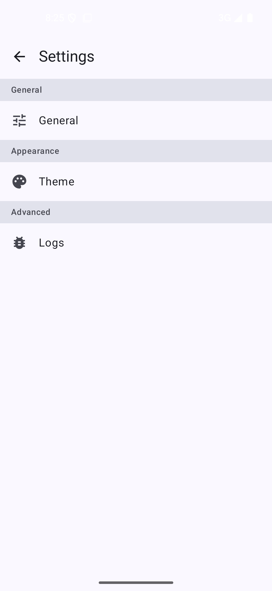

- Multi-language UI (English, Romanian, German, French)

## Vox Expenses

Standalone, encrypted on-device expense tracker (`com.voxapps.expenses`, Room + SQLCipher). Voice-created
through Commander (`create`/`read`), scanned from a receipt via Vox Vision, captured automatically from
bank/payment notifications, or entered by hand.

- **Three capture paths, three prompts** — voice (`ExpenseParsePromptBuilder`), receipt OCR
  (`ExpenseScanCleanupPromptBuilder` — extracts vendor, bank, per-item net/VAT/gross when printed, and
  prioritizes the receipt's own printed total over recomputing it from line items), and notification
  capture (`NotificationExpenseParsePromptBuilder` — a deliberately narrower extraction: title/amount/
  currency/vendor/category plus an `isPayment` triage flag, since notification text isn't guaranteed to
  even be a transaction) — all three route through Commander's generic LLM hook, just with different
  `task` IDs and prompts suited to how much structure each source actually has
- **Rescan suggestions** — re-running OCR/AI cleanup on an already-saved expense (e.g. after attaching
  a clearer photo) no longer overwrites fields silently: each field the rescan corrected shows up as its
  own dismissible suggestion chip next to the current value, so you approve or reject them individually
  instead of trusting the whole rewrite at once. An **auto-rescan on first attachment** setting
  (Settings, off by default) triggers this automatically the moment a stub expense gets its first photo.

  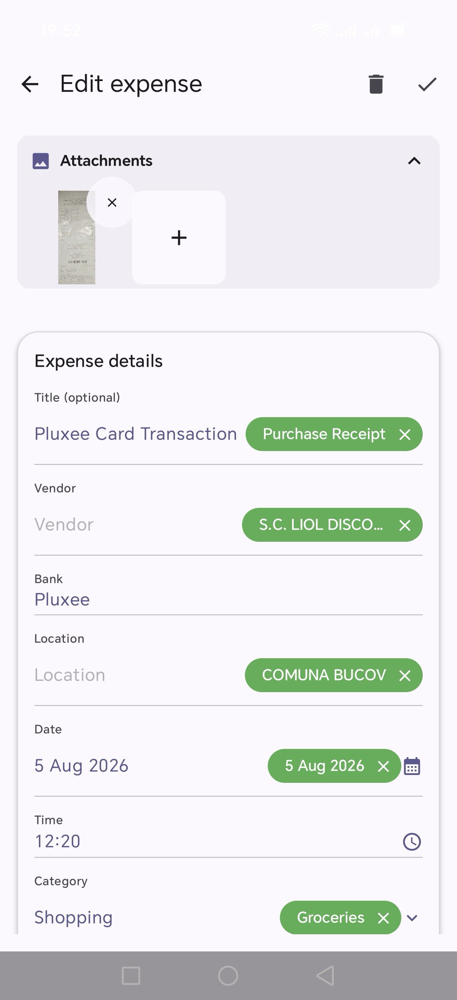

- **Notification capture** — an opt-in `NotificationListenerService` inspects notifications only from
  apps the user explicitly allowlists (Settings → Notification capture); a matched notification is a
  **pending suggestion** the user must approve or dismiss unless "Auto-accept" is enabled, in which case
  it's inserted directly (still a normal, editable expense row afterward, and still subject to the
  duplicate-rule engine below). The parsing prompt itself adapts to whichever LLM engine is currently
  active — see **Notification-parse prompt tuning** below. Notifications the listener missed (OS-killed
  process, dropped broadcast) get a "last chance" capture on dismissal, plus a manual "Force-check
  notifications now" button (debounced — a rapid double-tap can't dispatch the same notification twice)
  that bypasses the already-processed guard for whatever's still in the notification shade. The
  source-app allowlist picker is a shared `:core:apppicker` card (full-screen modal with Cancel/Done
  confirmation, search + all/user/system filter) backed by a persisted launcher-apps cache — scanned
  once ever, reloaded from cache on every later launch, with a manual "Rescan Apps" button for when a
  new app is installed (plus, on Honor/MagicOS devices, a warning and an App Info shortcut if the OEM's
  own "get installed apps" permission gate is silently emptying the scanned list despite
  `QUERY_ALL_PACKAGES` being granted, and a deep link into that OEM's own app-launch-management screen —
  independent of stock battery-optimization exemption — since it can otherwise block the listener from
  ever rebinding after the process is killed). The request to Commander is now durably queued rather
  than fire-and-forget — see
  [Durable delivery: the pending-request queue](TECHNICAL_DOCUMENTATION.md#durable-delivery-the-pending-request-queue-voxllmrequestqueue)
  — so a notification is recovered automatically even if Commander was killed/stopped at capture time.
- **Notification-parse prompt tuning** — the notification-capture prompt (`NotificationExpenseParsePromptBuilder`)
  branches on whether Commander's currently-active engine is local or cloud (queried once per capture
  via `VoxCapabilityClient.isLocalEngine`): a local engine gets the few-shot examples and a short
  anti-copy clause that exist specifically to work around a small on-device model's demonstrated
  tendency to leak literal example content into real output (backstopped by a deterministic code-side
  strip regardless of what the model does); a cloud engine, which doesn't share that failure mode, gets
  a shorter, example-free prompt instead of a padded-out copy of the local one.
- **Transaction direction** — every expense is tagged outgoing (money spent) or incoming (money
  received/refunded); Reports splits **Total** (outgoing only) from **Received** instead of netting
  them into one misleading figure. Voice/scan/notification parsing infers direction from the source
  text (e.g. "refund," a bank credit notification) and defaults to outgoing when ambiguous.
- **Duplicate detection** (Settings → Expense cleanup) — a generic, user-configurable rule engine
  (`RuleBasedDuplicateChecker`, shared via `:core:datahygiene` — see
  [Generic duplicate-rule engine](TECHNICAL_DOCUMENTATION.md#generic-duplicate-rule-engine)), modeled on
  email-client filters: any expense field (title, vendor, bank, location, comments, amount, currency,
  category, direction, date/time) can be added to a named rule with its own AND/OR, multiple rules
  combine via one global AND/OR, and each rule independently chooses exact-vs-fuzzy string matching and
  a shared time window (1–15 min). Two default rules are pre-seeded reproducing the app's original
  behavior (same amount+currency+direction+time, plus title OR vendor).
  - **Automatic protection** (what runs on every insert) has four modes: **Off**, **Local** (silently
    merges an obvious rule match), **Local + AI** (local merge plus a small AI-scoped confirmation
    check queued for review), and **AI** (review-only, no local merge). A per-rule "applies
    automatically at save" toggle scopes which rules participate here vs. review-only contexts. The
    AI-scoped recall step for **Local + AI** (both automatic and manual/scheduled) uses the same
    configured rules to decide what's worth showing the AI, respecting your time window and field
    choices; pure **AI** mode has no local component and deliberately never consults the rules at all,
    recalling by a fixed amount/currency/direction match instead.
  - **Manual review** (only shown for Local/Local + AI) — when on, an insert-time local-rule match is
    added to the same pending-review list "Check for duplicates now" produces, instead of merging
    silently, so nothing changes without a look first.
  - This replaced two previously-separate systems (an always-on exact-match checker comparing by
    calendar day, and a 3-checkbox near-duplicate add-on) with the one rule engine above — see the
    technical doc link for the full evaluation model.
- **Data-quality scoring for merges** — when two duplicates merge (silently, or approved from the
  review list), which record's data wins per field is no longer just "whichever arrived first": each
  expense is scored on how it was captured (Manual > Scan > Notification > Voice — manual entry is the
  most trustworthy, voice the most error-prone for proper nouns like vendor names) plus how many
  optional fields it actually has filled in, and a manually-edited record always outranks everything
  else. The review list's "keep" selection defaults to whichever group member scores highest (still
  overridable via the radio buttons) and shows each candidate's capture-source tag alongside its
  total/bank/vendor/date-time, so the default is explainable rather than a black box. Approving a
  review group now backfills the kept row's blank fields from its higher-scoring duplicates before
  deleting them, instead of discarding that data outright.
- **Category color adjacency + merchant category memory** — a freshly auto-created category's color is
  chosen to visibly differ from the most-recently-added expense's category (not just from the aggregate
  palette), and repeatedly correcting the same vendor to the same category (configurable 1×/3×/5×/10×
  streak, off by default) makes that mapping auto-apply to future captures for that vendor, overriding
  whatever the LLM/default would otherwise suggest — see **Category cleanup** below for the streak
  toggle's exact location.
- **Inline category creation** — the category dropdown on the expense-edit screen has a
  "+ New category..." entry that opens the picker described below without leaving the screen; the new
  category is selected immediately on save.
- **Line items & VAT** — optional per-item net/VAT/gross breakdown, shown only when enabled (most
  receipts don't carry this detail); a red warning banner appears if the total doesn't match the sum of
  line items, without blocking editing
- **Currency & exchange rates** — a default currency for new expenses, a separate home currency reports
  convert *into* when expenses mix currencies, and a locale-independent decimal separator setting (comma
  vs. period) so typed amounts round-trip correctly regardless of device locale
- **Spending limits** — per-category/per-period budget alerts, checked by a scheduled `WorkManager` job
  (`SpendingLimitCheckWorker`) and delivered as a system notification
- **Category cleanup** (Settings → Categories) — "Remember merchant categories" toggle + 1×/3×/5×/10×
  threshold chips (see above), plus the same Commander LLM-hook pattern as Vox Notes: auto-merge finds
  and merges near-duplicate categories, on-demand or on a schedule
- **Expense cleanup** (Settings → Expense cleanup) — one tab covering automatic protection and the
  duplicate-rule engine (see **Duplicate detection** above), plus an on-demand **"Check for duplicates
  now"** button and a **scheduled** equivalent, both of which stage matches into the same pending-review
  list regardless of trigger — the Commander LLM-hook pattern, reviewed and approved per group before
  anything merges or deletes
- **Calendar view** (optional, off by default) — same shared `:core:calendar` module as Vox Notes, plus
  bank/vendor filters and an amount ascending/descending sort; sorting by amount isn't chronological, so
  it temporarily disables the calendar view (a dismissible chip restores it)
- **Reports** — Total (outgoing)/Received split (see Transaction direction above) and by-category
  breakdowns, converted into the home currency
- **Category color picker** — shared `:core:design` component (also used by Vox Notes/Vox Calendar):
  a scrollable preset row with a clear ring around the selected swatch, plus a "Custom…" entry opening a
  full-screen color screen (Hue/Saturation/Value sliders, live preview, the same presets for a quick
  pick). Auto-generated presets sit at evenly-spaced hues so they're never visually close to each other.
- **Attach photo on scan / on retry** (Settings, off by default, independent toggles) — sends the
  receipt photo to the AI alongside the OCR text when Vision provided one and the configured engine
  supports images; retry (re-sending already-staged OCR text after a failed parse) is a separate
  toggle since it's a distinct, less frequent path
- **Attachments** — a collapsible thumbnail strip on every expense for extra photos beyond the
  original receipt scan (e.g. a warranty card, a second page); tap a thumbnail for a full-screen
  zoomable view, with an inline add/remove — same shared component as Vox Notes/Vox Calendar. Adding one
  now offers **"Choose from gallery"** alongside the camera, plus the same **Single / Stitch / Batch**
  capture-mode chooser Vox Vision uses (see [Vox Vision](#vox-vision) above); removing one now asks for
  confirmation first instead of deleting on the first tap. An expense with at least one attachment (the
  original scan or a manually-added one) shows a small paperclip icon right after its title, in both the
  in-app list and the home-screen widget.

  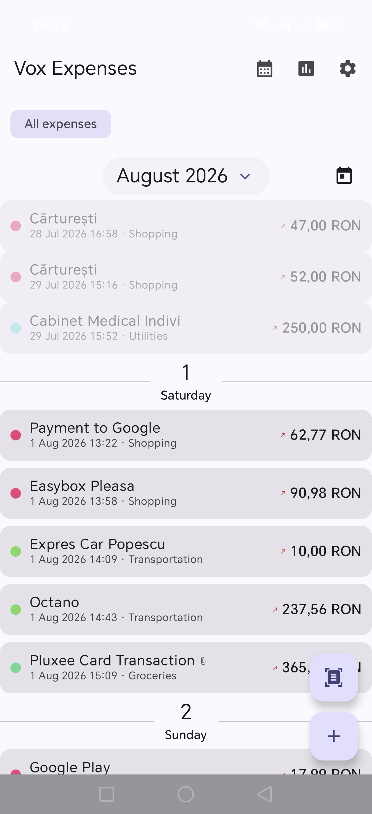

- **Location** (Settings → General, shared `:core:location` module also used by Vox Commander) — the
  same cached-location/Home-town/"Always use this location" system described under
  [Vox Commander](#vox-commander) above, used here to prefill an expense's location field.
- **Backup & Restore** (Settings → Data → Backup & Restore) — back up expenses/categories/duplicate
  rules/settings to a file you pick, or restore from one, using the same zip format Vox Hub's own
  export/import produces; restoring offers **Full override**, **Merge**, or **Additive** reconciliation
  (see [Vox Hub](#vox-hub) below).

  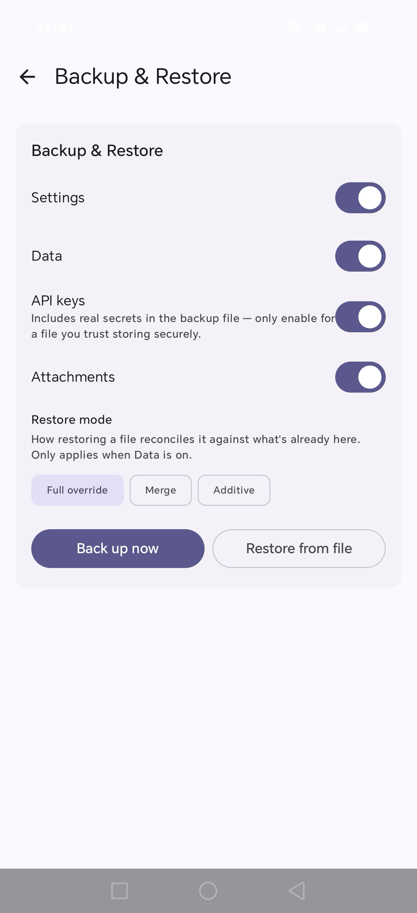

- **Home-screen widget** (Jetpack Glance) — recent expenses grouped by day, category-colored rows,
  tap an expense to edit it in place, plus Add/Scan actions
- **Battery-optimization exemption prompt** — Settings → Notification Capture and first-launch
  onboarding both offer a direct button into the OS's "ignore battery optimizations" dialog, since some
  OEMs' aggressive background-process killers can silently unbind the notification listener otherwise
- **"Today" particle-effect theming** and **custom notification controls** (Settings, shared `:core:design`
  components also used by Vox Notes/Vox Calendar) — see [Vox Calendar](#vox-calendar) below for what
  each does and a screenshot.
- Settings is grouped into labeled section banners (General/Appearance/Notifications/Data/Advanced),
  same shared pattern as every app in the family.

  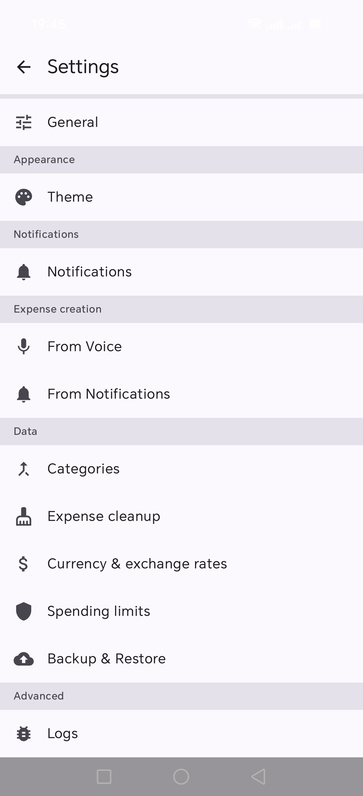

- **Peer-to-peer device sync** (paired from Vox Hub, see [Vox Hub](#vox-hub) below) — genuinely
  bidirectional sync with another phone over NFC + Bluetooth, no cloud; category-scoped, last-write-wins
  on a conflicting edit, deletions propagate via tombstones
- Multi-language UI (English, Romanian, German, French)

## Vox Calendar

Standalone, encrypted on-device calendar (`com.voxapps.calendar`, Kotlin/AGP namespace
`com.voxapps.calendarapp` to avoid a dex-merge clash with the reused `:core:calendar` module — see its
own doc comment). Voice-created through Commander (`create`/`read`) or used entirely on its own.

- **Year / Month / Week / Day views** behind a collapsible sidebar; Month reuses the shared
  `:core:calendar` engine, Week/Day are a new local hour-of-day grid, Year is 12 compact mini-months. Day
  view draws a red **"now" line** at the current time-of-day position and auto-scrolls to land near it
  on first open — the same "now" concept the ToDo timeline and home-screen widget also show (see below).
  Once nothing's left for today, a **"Nothing else today"** label shows up right after the now-line (Day
  view, the ToDo timeline, and the home-screen widget alike), bracketed by a time-of-day emoji pair
  (☕/☀️ morning-day, 🍵/🌅 golden hour, 🌙/✨ night) that stays in sync across all three.

  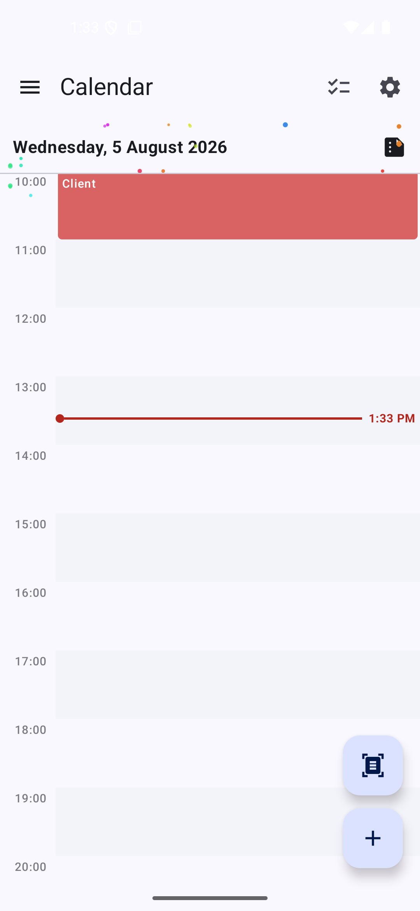
  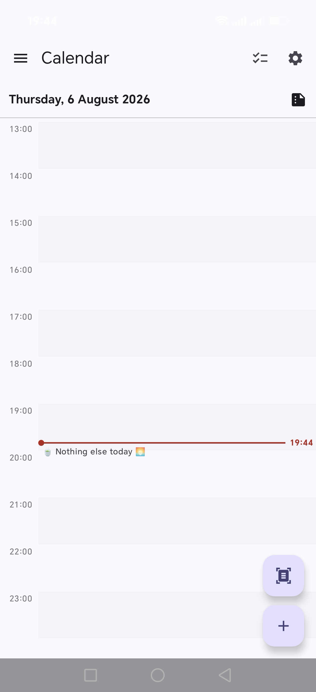

- **Colored, named layers** (e.g. Personal / Work / Moon Calendar) instead of a hierarchical
  category tree — flat layers plus optional flat tags, each layer independently toggleable and
  color-coded via the same shared `:core:design` picker Vox Expenses/Vox Notes use (scrollable
  presets, clear selection ring, "Custom…" full-screen HSV picker with live preview). Typing a new tag
  on an entry shows an inline **tag-suggestion** card of previously-used tags, expanding directly above
  the input rather than a popup, and stays open so several tags can be added in one pass.

  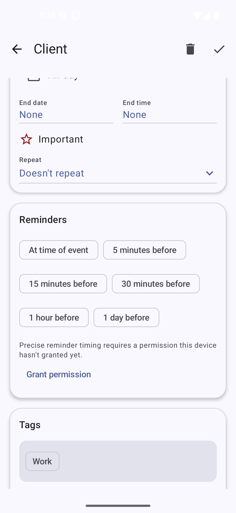

- **Natural-language event/task creation via Commander** — "dentist in a week" resolves the date
  entirely through the LLM (no local date-NLU), picks the right layer by name (exact match → fuzzy
  match via `:core:textmatch` → configurable default), and works for both timed events and due-date
  tasks
- **ICS import/export** (Settings → ICS import/export) via the `biweekly` library — spec-correct
  interop with Google Calendar/Thunderbird/Apple Calendar, independent of the Hub JSON backup path
- **Day-summary sheet** — tapping a day shows that day's Calendar entries plus Notes/Expenses inline
  (a day-scoped `OP_READ` extension to the Vox contract), every row styled and colored the same way as
  the home-screen widgets and directly tappable into that record's editor; a Notes/Expenses section is
  omitted entirely (not shown empty) when that app isn't installed, checked locally before ever
  attempting the cross-app fetch. The reverse direction (Notes/Expenses → open Calendar on a date) uses
  a plain explicit-intent extra, not the broadcast bus
- Recurrence is deliberately minimal (none/daily/weekly/monthly/yearly + optional until-date, expanded
  at read time) — no RRULE engine, no per-occurrence materialized rows, editing a series edits the
  whole thing
- **ToDo Lists** — a dedicated checklist system alongside the calendar proper, reached via its own icon
  on the Calendar screen's header. Create any number of named lists, each a flippable card (tap to flip
  between a view face and an edit face) holding a vertical timeline of items:
  - An **"Important" star** marks an item with a 5-point-star node instead of a plain circle.
  - The single most-imminent undone item gets an **"Up Next"** marker — a bigger, gently pulsing node
    with a rotated label.
  - A **"Now" splitter line** divides past-due items from upcoming ones in the same list, the same
    concept as Day view's now-line.
  - Items **bleed into the Month/Day calendar grid and the home-screen widget** as the same star/circle
    markers, so a checklist due-date shows up right alongside real calendar entries without being a
    separate, easy-to-forget screen.
  - **Scan-to-item** — a document-scan icon on a list's edit face sends a photo through Vox Vision's OCR
    and Commander's cleanup LLM straight into a new checklist item.
  - Per-list and per-item **color pickers** (a vertical swatch strip for lists, the same shared picker
    used elsewhere for items), a due-date/time quick-picker with reminder-offset presets, and a unified
    edit dialog (title, color, Done toggle, Important toggle, due date/time, reminders) in one place.

  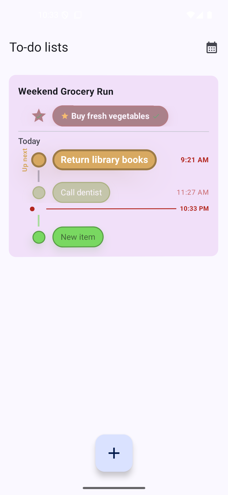
  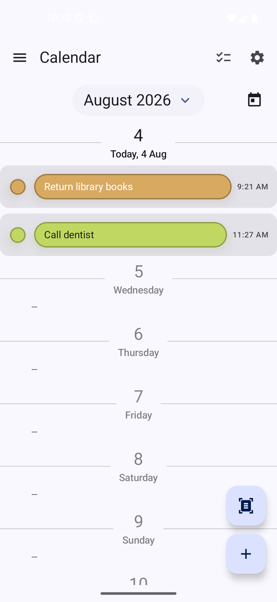
  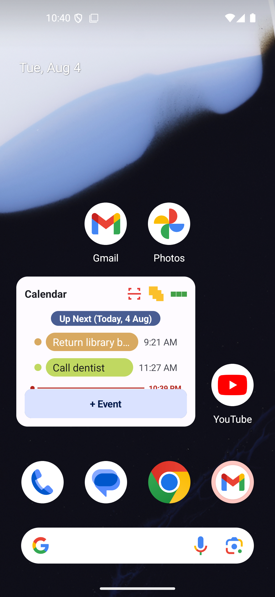
  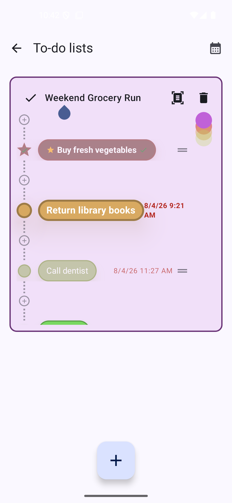
  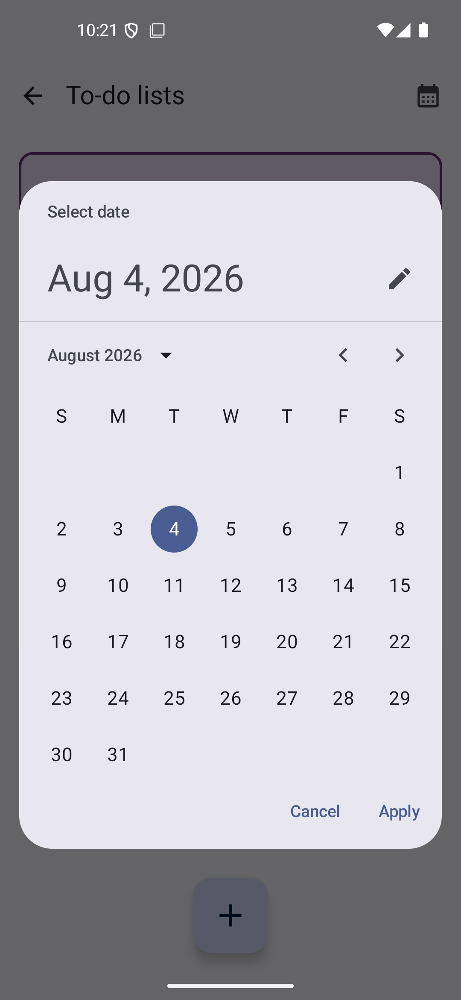
  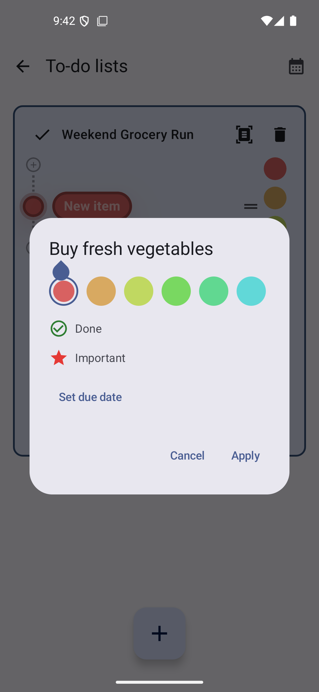
  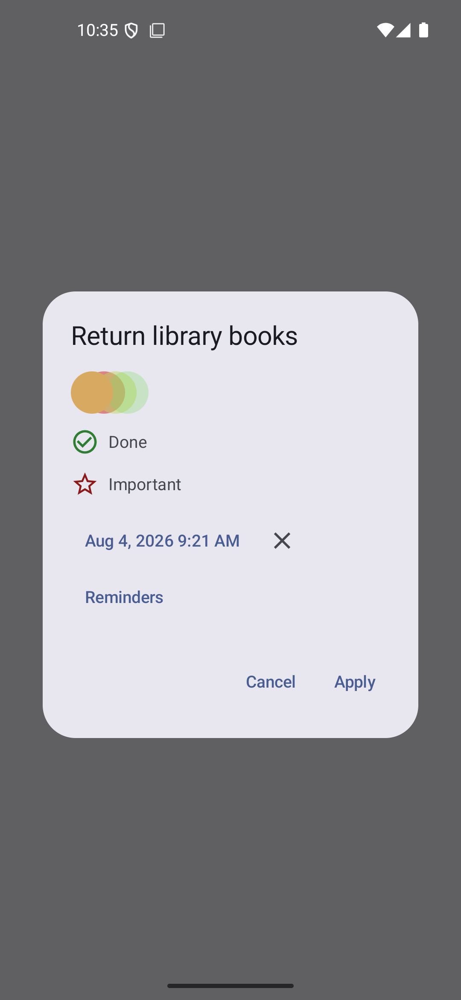

- **Attachments** — a collapsible thumbnail strip on every entry for extra photos (e.g. a ticket, a
  booking confirmation); tap a thumbnail for a full-screen zoomable view, with an inline add/remove.
  Adding one now offers **"Choose from gallery"** alongside the camera, plus the same **Single / Stitch /
  Batch** capture-mode chooser Vox Vision uses (Stitch live-joins several overlapping shots of one
  document, Batch defers OCR on a batch of photos until the session ends) — the "add" tile opens a
  chooser dialog rather than jumping straight to the camera. Shared component, same on Vox Notes/Vox
  Expenses. An entry with at least one attachment shows a small paperclip icon right after its title, in
  the calendar grid, the ToDo list, and the home-screen widget alike (see
  [Vox Expenses](#vox-expenses)'s screenshot for what this looks like).

  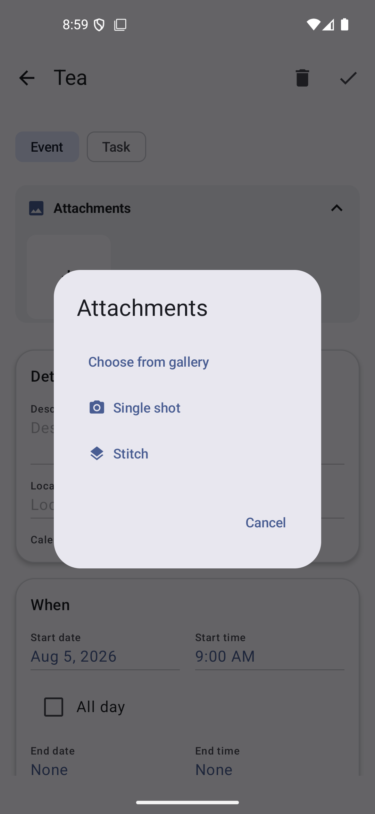

- **Backup & Restore** (Settings → Data → Backup & Restore) — back up events/layers/ToDo
  lists/settings to a file you pick, or restore from one, using the same zip format Vox Hub's own
  export/import produces; restoring offers **Full override**, **Merge**, or **Additive** reconciliation
  (see [Vox Hub](#vox-hub) below).

- **"Today" particle-effect theming** (Settings → Theme, `:core:design`'s `TodayEffects`, shared with
  Vox Notes/Vox Expenses) — an animated Canvas particle highlight on the current day, with five presets
  (Fire, Glow, Waves, Rainbow, Neon Pulse) and a choice of emission style (a ring, the background, or
  full-card).

  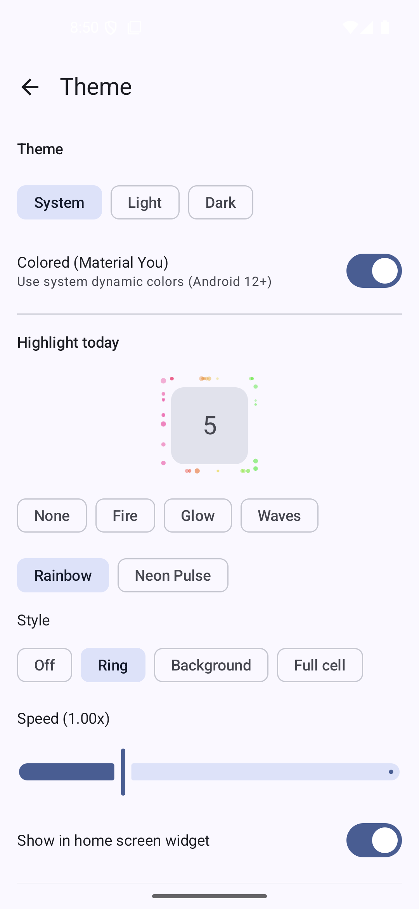

- **Custom notification controls** (Settings, shared with Vox Notes/Vox Expenses) — choose the
  notification sound (system default or any ringtone via the system picker), volume, vibration on/off,
  and playback length, with an in-settings preview.

  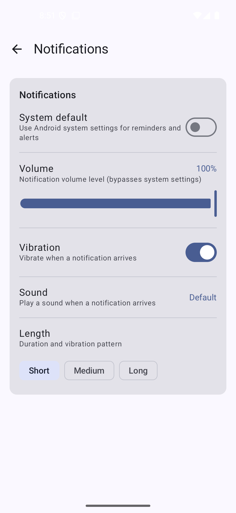

- Settings is grouped into labeled section banners (General/Appearance/Notifications/Data/Advanced) —
  cosmetic, but shared across every app in the family (Notes, Expenses, Calendar, Vision, Hub).

  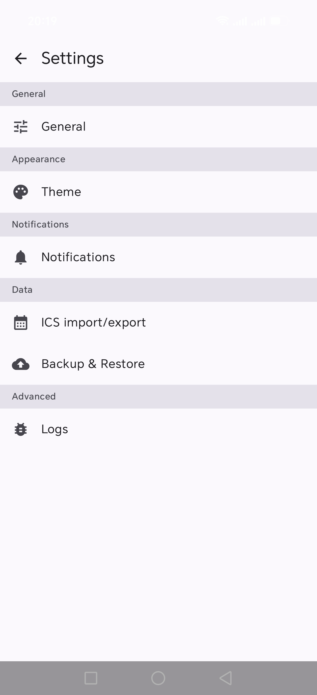

- **Home-screen widget** (Jetpack Glance) — upcoming entries grouped by day (today bolded, its
  divider thicker), layer-colored rows with tag chips, tap an entry to edit it in place, plus
  Add/Scan actions
- **Peer-to-peer device sync** (paired from Vox Hub, see [Vox Hub](#vox-hub) below) — genuinely
  bidirectional sync with another phone over NFC + Bluetooth, no cloud; layer-scoped, last-write-wins
  on a conflicting edit, deletions propagate via tombstones
- Multi-language UI (English, Romanian)

## Vox Hub

A lightweight, database-free backup/restore utility (`com.voxapps.hub`) — not a voice-command
satellite (it registers no NLU domain), just an IPC *client* over the same `:core:ipc` contract every
other satellite implements as a server.

- **Zero hardcoded app list** — at launch it calls `VoxAppsDiscovery` to find every installed Vox app
  that advertises `export`/`import` in its manifest meta-data; a new satellite (like Vox Calendar) shows
  up automatically with no Hub-side code change
- **Export** — one card per discovered app with four independent toggles (**Settings**, **Data**, **API
  keys**, **Attachments** — Data/Attachments only shown for apps that actually have record data, e.g.
  not Commander), plus an **All** toggle that sets every toggle for every app at once; bundles every
  selected app's exported JSON — and, when its Attachments toggle is on, that app's photo attachments —
  into one dated zip via `ActivityResultContracts.CreateDocument`. This exact configuration is also
  what **scheduled backups** use (see below) — there's no separate data-selection step for those
- **Import** — reads a previously exported file, previews a per-app record-count summary before
  anything is written, and lets the user deselect individual apps; each target app reconciles its own
  records against the import per one global **Import mode** (see below) and re-attaches any bundled
  photos to the newly-restored records
- **Import mode** (Settings → Backup schedule) — one global choice of how every app reconciles an
  imported file against what's already on it: **Full override** (delete everything that app already had,
  then insert the import), **Merge** (only delete pre-existing rows older than the backup, so anything
  created since is kept), or **Additive** (never delete, only insert — the import just adds to what's
  already there). Still respects each app's own Data toggle above — an app with Data off is skipped for
  import entirely, regardless of this setting. Every satellite app's own local Backup & Restore screen
  (see e.g. [Vox Expenses](#vox-expenses) above) has this exact same 3-way choice for its own restore
  button, independent of Hub's global setting.

  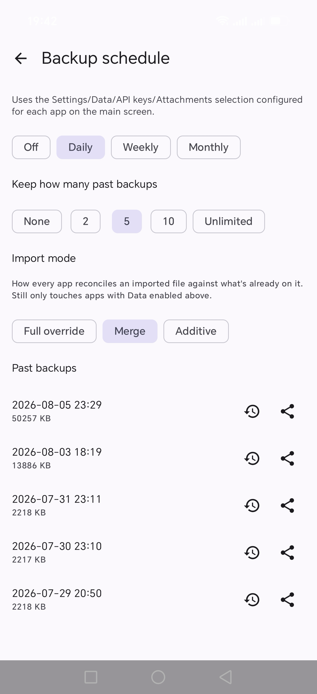

- **Scheduled backups** — off/daily/weekly/monthly interval (`WorkManager`), configurable retention
  (none/2/5/10/unlimited, with a storage-growth warning at unlimited), a dismissible failure banner
  when a scheduled run doesn't complete, and a past-backups list (capped to 5 visible rows, scrollable)
  with per-backup **Share** and **Restore** actions. Frequency/retention controls are disabled until at
  least one app has something selected in the Export card above — there's nothing to schedule otherwise
- **Backup & Restore, everywhere** — Notes, Expenses, Calendar, and Commander each have their own local
  Backup & Restore screen too (see each app's own section above) — save to or restore from a file you
  pick directly in that app, using the exact same zip format Hub's export/import produces, so a file
  saved from one path is importable via the other. Hub itself also has one, for its own settings.
- **Peer-to-peer device sync** — a second, genuinely *bidirectional* path alongside export/import's
  one-directional restore: pair two phones over NFC (tap to exchange identity + a session key — no
  Bluetooth PIN dialog), then sync Notes/Calendar/Expenses over Bluetooth Classic, both phones ending up
  with each other's changes, not one overwriting the other. Trigger a sync by tapping again, from a
  manual **Sync now** per paired device, or leave **Auto-sync** on for a background check every 15–240
  minutes (configurable). Per-peer category/layer checklist controls what's included. See
  [`TECHNICAL_DOCUMENTATION.md`'s Peer-to-peer device sync section](TECHNICAL_DOCUMENTATION.md#peer-to-peer-device-sync-op_sync_export--op_sync_merge)
  for the full architecture.
- **VoxConnect** — a QR-paired bridge to a PC companion (`core/voxconnect`): the *phone's* camera scans
  a QR code the desktop app displays (not the other way around, since most desktops have no camera) to
  exchange identity, then a foreground bridge service keeps the phone reachable for the PC side;
  schema-driven field discovery lets the PC app introspect what a paired phone can do without a
  hardcoded contract per feature, and a paired device can be renamed for easy identification when
  managing more than one.

  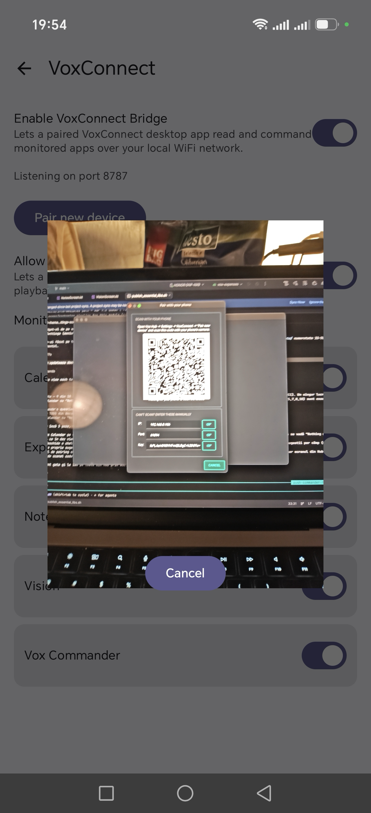
- Settings is grouped into labeled section banners (General/Appearance/Integrations/Advanced), same
  shared pattern as every app in the family.

  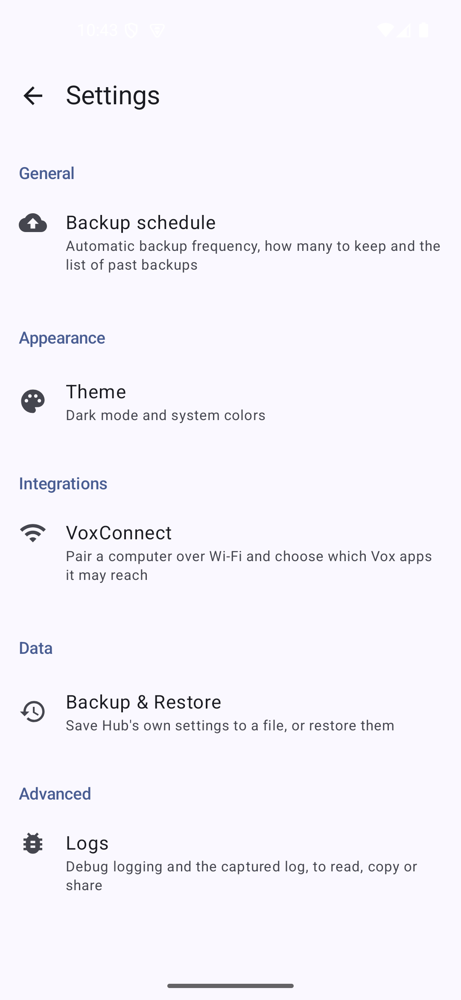

- Holds no local Room database for its own app data — sync's paired-device identities/keys are the one
  exception, kept in `EncryptedSharedPreferences`; everything else it persists itself is UI preference
  (theme, backup schedule)
